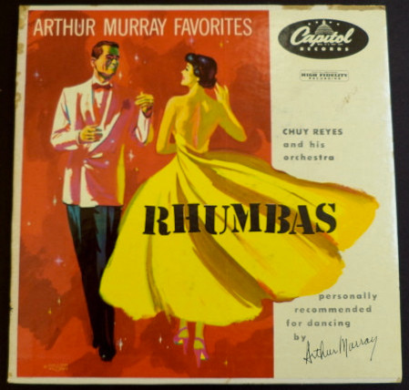

# Rhumbas

By Chuy Reyes & His Orchestra

## Album Data

[Discogs URL](https://www.discogs.com/release/5321400-Chuy-Reyes-And-His-Orchestra-Rhumbas)

- Label: Capitol Records
- Formats: Vinyl
Box Set, 7", 45 RPM, Album
- Genres: Latin, Rumba
- Rating: 0
- Released: null
- Year: 0
- Release ID: 5321400
- Media condition: 
- Sleeve condition: 
- Speed: 
- Weight: 
- Notes: 

## Album Tracks

| **Position** | **Title** | **Duration** |
|--------------|-----------|--------------|
| A | **Linda Mujer** |  |
| B | **The Flaming Rumba** |  |
| C | **Perhaps, Perhaps, Perhaps** |  |
| D | **Rumba De Fleur** |  |
| E | **Jack, Jack, Jack (Cu-Tu-Gu-Ru)** |  |
| F | **Love Me Lazy, Love Me Long** |  |
| G | **Obsession** |  |
| H | **"Mama" Son De La Loma** |  |

## Artist Roles

| **Name** | **Role** |
|----------|----------|
| **William George (3)** | Illustration |

