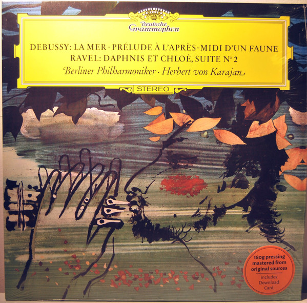

# La Mer · Prélude À L'Après-Midi D'Un Faune / Daphnis Et Chloé, Suite N° 2

By Claude Debussy

## Album Data

[Discogs URL](https://www.discogs.com/release/9648223-Debussy-Ravel-Berliner-Philharmoniker-Herbert-von-Karajan-La-Mer-Pr%C3%A9lude-LApr%C3%A8s-Midi-DUn-Faune-Dap)

- Label: Deutsche Grammophon
- Formats: Vinyl, LP, Reissue, Stereo
- Genres: Classical, Impressionist, Modern
- Rating: 4.33
- Released: 2016-08-08
- Year: 1965
- Release ID: 9648223
- Media condition: 
- Sleeve condition: 
- Speed: 
- Weight: 
- Notes: 

## Album Tracks

| **Position** | **Title** | **Duration** |
|--------------|-----------|--------------|
|  | **«La Mer»: Trois Esquisses Symphoniques** |  |
|  | **«Daphnis Et Chloé», Suite N° 2** |  |
| B2 | **Prélude À L'Après-Midi D'Un Faune (Vorspiel Zum Nachmittag Eines Fauns)** |  |

## Artist Roles

| **Name** | **Role** |
|----------|----------|
| **Claude Debussy** | Composed By |
| **Maurice Ravel** | Composed By |
| **Herbert von Karajan** | Conductor |
| **Günter Hermanns** | Engineer |
| **Karlheinz Zöller** | Flute [Soloflöte] |
| **Constantin Floros** | Liner Notes |
| **Berliner Philharmoniker** | Orchestra |
| **Otto Gerdes** | Producer |

