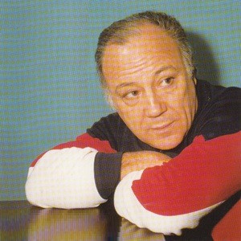

# Claudio Villa

## Artist Profile

Italian singer (1 January 1926 - February 7, 1987), he recorded over 3000 songs and sold over 45 million records.

## Artist Links

- [http://en.wikipedia.org/wiki/Claudio_Villa_%28singer%29](http://en.wikipedia.org/wiki/Claudio_Villa_%28singer%29)
- [https://www.imdb.com/name/nm0897585/?ref_=ttfc_fc_cl_t7](https://www.imdb.com/name/nm0897585/?ref_=ttfc_fc_cl_t7)

## See also

- [La Novia  (La Sposa) / Romantico Amore](La_Novia_La_Sposa_-_Romantico_Amore.md)
