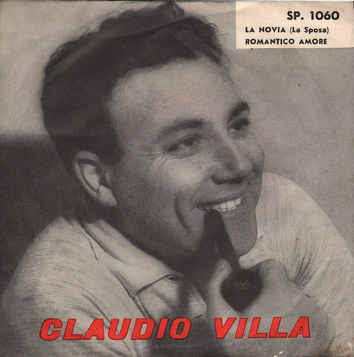

# La Novia  (La Sposa) / Romantico Amore

By Claudio Villa

## Album Data

[Discogs URL](https://www.discogs.com/release/3482574-Claudio-Villa-La-Novia-La-Sposa-Romantico-Amore)

- Label: Cetra
Cetra
- Formats: Vinyl, 7", 45 RPM
- Genres: Pop, Ballad, Vocal
- Rating: 5
- Released: 1961
- Year: 1961
- Release ID: 3482574
- Media condition: 
- Sleeve condition: 
- Speed: 
- Weight: 
- Notes: 

## Album Tracks

| **Position** | **Title** | **Duration** |
|--------------|-----------|--------------|
| A | **La Novia (La Sposa)** |  |
| B | **Romantico Amore** |  |

## Artist Roles

| **Name** | **Role** |
|----------|----------|
| **Elvio Monti E La Sua Orchestra** | Accompanied By [Orchestra] |

