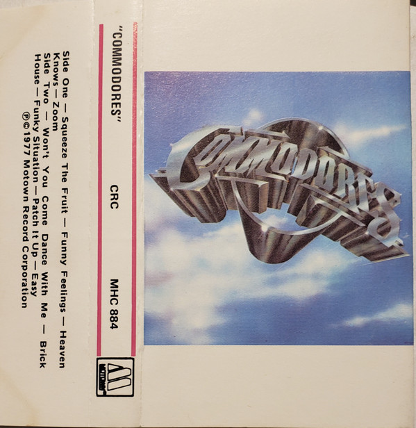

# Commodores

By Commodores

## Album Data

[Discogs URL](https://www.discogs.com/release/4157801-Commodores-Commodores)

- Label: Motown
- Formats: Vinyl, LP, Album
- Genres: Funk / Soul, Funk, Soul
- Rating: 3.88
- Released: 1977-03-15
- Year: 1977
- Release ID: 4157801
- Media condition: 
- Sleeve condition: 
- Speed: 
- Weight: 
- Notes: 

## Album Tracks

| **Position** | **Title** | **Duration** |
|--------------|-----------|--------------|
| A1 | **Squeeze The Fruit** | 2:58 |
| A2 | **Funny Feelings** | 4:50 |
| A3 | **Heaven Knows** | 4:48 |
| A4 | **Zoom** | 6:43 |
| B1 | **Won't You Come Dance With Me** | 3:49 |
| B2 | **Brick House** | 3:28 |
| B3 | **Funky Situation** | 3:44 |
| B4 | **Patch It Up** | 3:59 |
| B5 | **Easy** | 4:14 |

## Artist Roles

| **Name** | **Role** |
|----------|----------|
| **Jack Andrews** | Engineer [Mastering] |
| **Cal Harris** | Engineer [Recording] |
| **Jane Clark** | Engineer [Recording] |
| **Darrell Jones (2)** | Guitar [Pickin' And Finger Slickin'], Other [Very Special Thanks] |
| **Jack Andrews** | Lacquer Cut By |
| **Cal Harris** | Mixed By, Synthesizer [Godfather Of], Other [Very Special Thanks] |
| **James Anthony Carmichael** | Producer, Arranged By |
| **Commodores** | Producer, Arranged By, Written-By |

