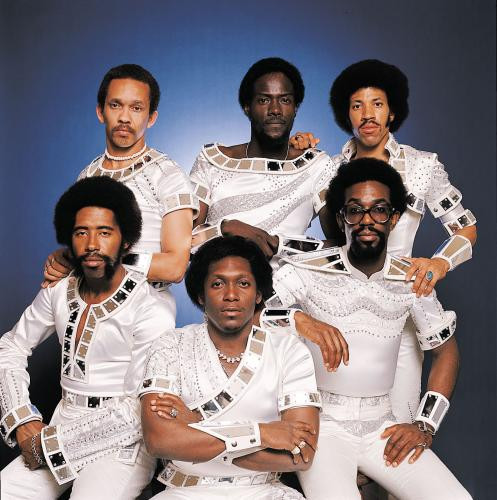

# Commodores

## Artist Profile

American funk soul band of the 1970s and 1980s.

They formed as freshmen in Tuskegee University, Alabama, in 1968.
They signed to Motown in 1972, starting with a support stint in The Jackson 5 tour.
They started recording in 1969 in a career that lasted to early 90's.
They have sold in total over 75 million records. 
Their peak years commercially were in the late 70's with ballads like "Easy", "Still" and "Three Times a Lady" that defined the style of Lionel Richie's solo career as well.
They are known for the dance funk numbers like "Machine Gun", "Brick House", "The Bump", "Fancy Dancer", and "Too Hot Ta Trot".
Their best work is produced by their permanent producer James Anthony Carmichael.
In 1978 they made a brief appearance in the disco movie "Thank God It's Friday".
When Lionel Richie left for a solo career, Heatwave's J.D. Nicholas replaced him.
Their first Grammy award came in 1985 with their Marvin Gaye tribute "Nightshift".
In 1982, Thomas McClary left the band and was replaced by Sheldon Reynolds.
In 1983 Skyler Jett replaced Lionel Richie for their world tour.

## Artist Links

- [https://www.commodoreslive.com/](https://www.commodoreslive.com/)
- [https://www.facebook.com/TheCommodores/](https://www.facebook.com/TheCommodores/)
- [https://www.whosampled.com/Commodores/](https://www.whosampled.com/Commodores/)
- [https://classic.motown.com/artist/the-commodores/](https://classic.motown.com/artist/the-commodores/)
- [https://en.wikipedia.org/wiki/Commodores](https://en.wikipedia.org/wiki/Commodores)
- [https://myspace.com/thecommodoresnow](https://myspace.com/thecommodoresnow)

## See also

- [Commodores](Commodores.md)
