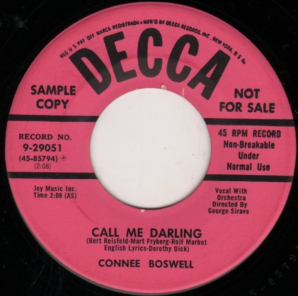

# Call Me Darling / The Philadelphia Waltz

By Connie Boswell

## Album Data

[Discogs URL](https://www.discogs.com/release/4962178-Connee-Boswell-Call-Me-Darling-The-Philadelphia-Waltz)

- Label: Decca
- Formats: Vinyl, 7", 45 RPM, Promo
- Genres: Pop, Vocal
- Rating: 0
- Released: 1954
- Year: 1954
- Release ID: 4962178
- Media condition: 
- Sleeve condition: 
- Speed: 
- Weight: 
- Notes: 

## Album Tracks

| **Position** | **Title** | **Duration** |
|--------------|-----------|--------------|
| A | **Call Me Darling** | 2:08 |
| B | **The Philadelphia Waltz** | 2:44 |

## Artist Roles

| **Name** | **Role** |
|----------|----------|
| **George Siravo** | Directed By |

