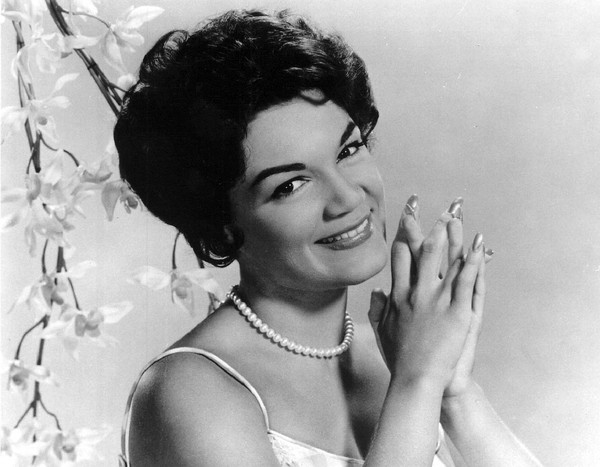

# Connie Francis

## Artist Profile

Concetta Rosa Maria Franconero (born December 12, 1937 in Newark, New Jersey), with Italian origins known professionally as Connie Francis, is an American pop singer best known for several international hit songs including "Who's Sorry Now?," "Lipstick on Your Collar," "Where the Boys Are" and "Stupid Cupid." She topped the Billboard Hot 100 singles chart on three occasions with "Everybody's Somebody's Fool," "My Heart Has a Mind of Its Own" and "Don't Break the Heart That Loves You." She was the top charting female US artist of the late 1950s and early 1960s.

## Artist Links

- [https://www.conniefrancis.com/](https://www.conniefrancis.com/)
- [https://www.facebook.com/ConnieFrancisOfficial/](https://www.facebook.com/ConnieFrancisOfficial/)
- [https://en.wikipedia.org/wiki/Connie_Francis](https://en.wikipedia.org/wiki/Connie_Francis)
- [https://www.imdb.com/name/nm0290120/](https://www.imdb.com/name/nm0290120/)

## See also

- [Be Anything (But Be Mine) / Tommy](Be_Anything_But_Be_Mine_-_Tommy.md)
- [Your Other Love / Whatever Happened To Rosemarie](Your_Other_Love_-_Whatever_Happened_To_Rosemarie.md)
