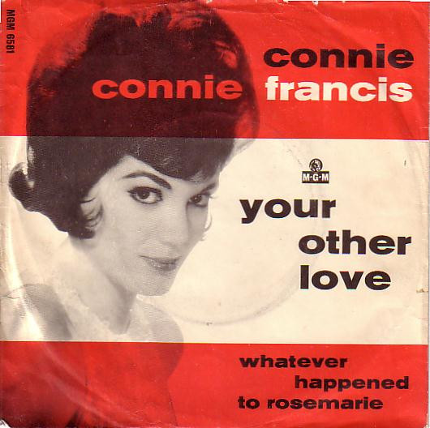

# Your Other Love / Whatever Happened To Rosemarie

By Connie Francis

## Album Data

[Discogs URL](https://www.discogs.com/release/1473028-Connie-Francis-Your-Other-Love-Whatever-Happened-To-Rosemarie)

- Label: MGM Records
MGM Records
- Formats: Vinyl, 7", 45 RPM, Single
- Genres: Rock, Pop Rock
- Rating: 3.67
- Released: 1963
- Year: 1963
- Release ID: 1473028
- Media condition: 
- Sleeve condition: 
- Speed: 
- Weight: 
- Notes: 

## Album Tracks

| **Position** | **Title** | **Duration** |
|--------------|-----------|--------------|
| A | **Your Other Love** | 2:05 |
| B | **Whatever Happened To Rosemarie** | 2:05 |

## Artist Roles

| **Name** | **Role** |
|----------|----------|
| **Claus Ogerman** | Conductor, Arranged By |

