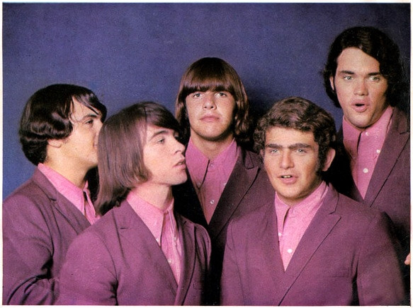

# Count Five

## Artist Profile

US band formed in 1964 in San Jose, California. Their psychedelic-punk hit, Psychotic Reaction, reached the US Top 5 in 1966. They first drew attention by wearing Dracula-style capes to their gigs. After recording one album, also titled Psychotic Reaction, they released a few more singles before disbanding in 1969.
The band's memory was immortalized in a 1972 essay by the famous rock writer Lester Bangs called Psychotic Reactions and Carburetor Dung. In the essay Bangs credited the band for having released several albums - Carburetor Dung, Cartesian Jetstream, Ancient Lace and Wrought-Iron Railings and Snowflakes Falling On the International Dateline: actually, none of these albums has ever existed, except in Bangs' own imagination.
Line-up:
- John "Sean" Byrne: vocals, guitar
- John "Mouse" Michalski: lead guitar
- Roy Chaney: bass
- Craig "Butch" Atkinson: drums
- Kenn Ellner: harmonica, vocals.

## Artist Links

- [http://en.wikipedia.org/wiki/Count_Five](http://en.wikipedia.org/wiki/Count_Five)
- [http://www.nemsworld.com/count5/count5.htm](http://www.nemsworld.com/count5/count5.htm)
- [https://myspace.com/countfive](https://myspace.com/countfive)
- [http://countfive.com/](http://countfive.com/)

## See also

- [Psychotic Reaction](Psychotic_Reaction.md)
