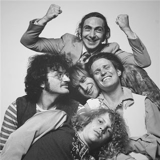

# Country Joe And The Fish

## Artist Profile

Folk rock/psychedelic rock band formed in 1965 in Berkeley, California by Country Joe McDonald and Barry Melton ("The Fish"). The band was disbanded after their final performance on June 21, 1970. They reformed in 1976 to play a couple of shows and record the "Reunion" album.

## Artist Links

- [http://www.well.com/~cjfish/](http://www.well.com/~cjfish/)
- [http://en.wikipedia.org/wiki/Country_Joe_And_The_Fish](http://en.wikipedia.org/wiki/Country_Joe_And_The_Fish)
- [https://www.imdb.com/name/nm1278966/](https://www.imdb.com/name/nm1278966/)

## See also

- [I-Feel-Like-I'm-Fixin'-To-Die](I-Feel-Like-Im-Fixin-To-Die.md)
