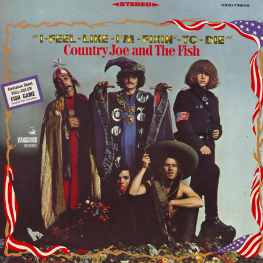

# I-Feel-Like-I'm-Fixin'-To-Die

By Country Joe And The Fish

## Album Data

[Discogs URL](https://www.discogs.com/release/2014928-Country-Joe-And-The-Fish-I-Feel-Like-Im-Fixin-To-Die)

- Label: Vanguard
Vanguard
- Formats: Vinyl, LP, Album, Stereo
- Genres: Rock, Blues, Blues Rock, Psychedelic Rock, Jug Band
- Rating: 4.13
- Released: 1967-11-00
- Year: 1967
- Release ID: 2014928
- Media condition: 
- Sleeve condition: 
- Speed: 
- Weight: 
- Notes: 

## Album Tracks

| **Position** | **Title** | **Duration** |
|--------------|-----------|--------------|
| A1 | **The Fish Cheer & I-Feel-Like-I'm-Fixin'-To-Die** | 3:39 |
| A2 | **Who Am I** | 4:05 |
| A3 | **Pat's Song** | 5:22 |
| A4 | **Rock Coast Blues** | 3:42 |
| A5 | **Magoo** | 4:56 |
| B1 | **Janis** | 2:34 |
| B2 | **Thought Dream** | 6:11 |
| B3 | **Thursday** | 3:45 |
| B4 | **Eastern Jam** | 4:23 |
| B5 | **Colors For Susan** | 5:57 |

## Artist Roles

| **Name** | **Role** |
|----------|----------|
| **Claude Rie** | Lacquer Cut By |
| **Barry Melton** | Music By, Words By |
| **Bruce Barthol** | Music By, Words By |
| **Country Joe McDonald** | Music By, Words By |
| **David Cohen** | Music By, Words By |
| **Gary Hirsh** | Music By, Words By |
| **Joel Brodsky** | Photography By |
| **Samuel B. Charters** | Producer |
| **Ed Friedner** | Recorded By, Effects [Special] |

