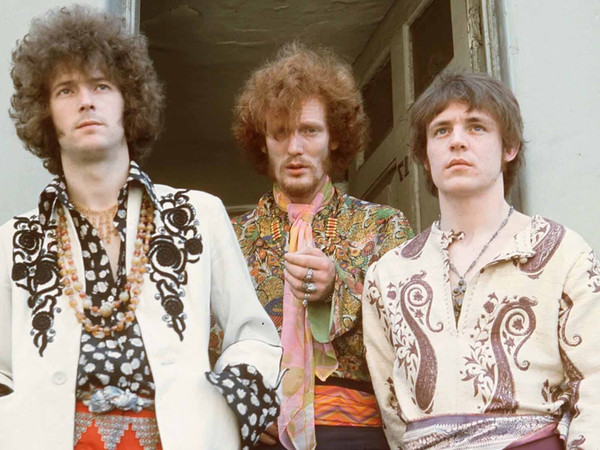

# Cream

## Artist Profile

British rock band formed in London in 1966 best known for their songs "Sunshine of Your Love" and "White Room" and widely considered to be the world's first supergroup before disbanding in 1968. In 2005 the band reformed to play 4 shows at the Royal Albert Hall and 3 shows at Madison Square Garden. 

Eric Clapton: guitar, vocals
Jack Bruce: bass guitar, acoustic guitar, harmonica, vocals, cello, piano, organ, recorder
Ginger Baker: drums, percussion, vocals

Inducted into the Rock and Roll Hall of Fame in 1993 (Performer).

## Artist Links

- [https://en.wikipedia.org/wiki/Cream_%28band%29](https://en.wikipedia.org/wiki/Cream_%28band%29)
- [http://amiright.com/artists/cream.shtml](http://amiright.com/artists/cream.shtml)
- [https://genius.com/artists/Cream](https://genius.com/artists/Cream)
- [https://www.last.fm/music/Cream](https://www.last.fm/music/Cream)

## See also

- [Disraeli Gears](Disraeli_Gears.md)
- [Wheels Of Fire](Wheels_Of_Fire.md)
