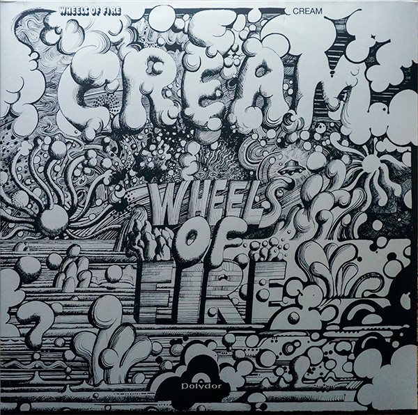

# Wheels Of Fire

By Cream

## Album Data

[Discogs URL](https://www.discogs.com/release/7102933-Cream-Wheels-Of-Fire)

- Label: Polydor
Polydor
- Formats: Vinyl, LP, Album, Reissue
- Genres: Rock, Blues, Blues Rock, Classic Rock, Psychedelic Rock
- Rating: 4.47
- Released: 2015-05-18
- Year: 1968
- Release ID: 7102933
- Media condition: 
- Sleeve condition: 
- Speed: 
- Weight: 
- Notes: 

## Album Tracks

| **Position** | **Title** | **Duration** |
|--------------|-----------|--------------|
|  | **In The Studio** |  |
| A1 | **White Room** | 4:56 |
| A2 | **Sitting On Top Of The World** | 4:56 |
| A3 | **Passing The Time** | 4:31 |
| A4 | **As You Said** | 4:19 |
| B1 | **Pressed Rat And Warthog** | 3:13 |
| B2 | **Politician** | 4:11 |
| B3 | **Those Were The Days** | 2:52 |
| B4 | **Born Under A Bad Sign** | 3:08 |
| B5 | **Deserted Cities Of The Heart** | 4:36 |
|  | **Live At The Fillmore** |  |
| C1 | **Crossroads** | 4:13 |
| C2 | **Spoonful** | 16:44 |
| D1 | **Traintime** | 6:52 |
| D2 | **Toad** | 15:53 |

## Artist Roles

| **Name** | **Role** |
|----------|----------|
| **Martin Sharp (2)** | Artwork [Album Art] |
| **Stanislaw Zagorski** | Design [Album Design] |
| **Adrian Barber** | Engineer |
| **Bill Halverson** | Engineer |
| **Tom Dowd** | Engineer |
| **Adrian Barber** | Engineer [Re-mix] |
| **Lex van Coeverden** | Lacquer Cut By |
| **Lex van Coeverden** | Mastered By |
| **Felix Pappalardi** | Producer |
| **Robert Stigwood** | Producer [By Arrangement With] |

