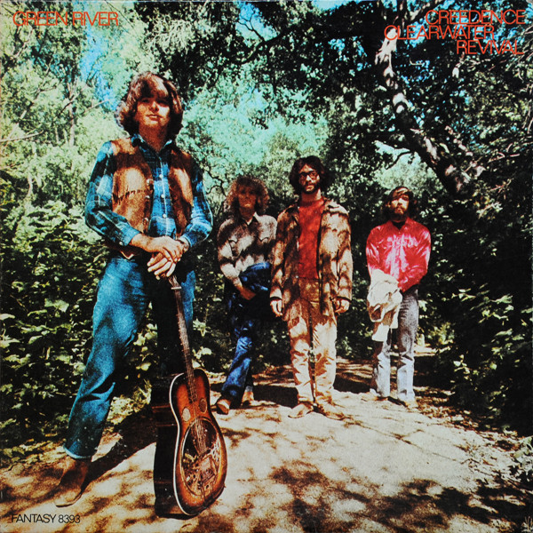

# Green River

By Creedence Clearwater Revival

## Album Data

[Discogs URL](https://www.discogs.com/release/5980014-Creedence-Clearwater-Revival-Green-River)

- Label: Fantasy
Fantasy
- Formats: Vinyl, LP, Album, Reissue, Stereo
- Genres: Rock, Folk Rock, Country Rock
- Rating: 4.37
- Released: null
- Year: 1969
- Release ID: 5980014
- Media condition: 
- Sleeve condition: 
- Speed: 
- Weight: 
- Notes: 

## Album Tracks

| **Position** | **Title** | **Duration** |
|--------------|-----------|--------------|
| A1 | **Green River** | 2:31 |
| A2 | **Commotion** | 2:37 |
| A3 | **Tombstone Shadow** | 3:36 |
| A4 | **Wrote A Song For Everyone** | 4:55 |
| B1 | **Bad Moon Rising** | 2:17 |
| B2 | **Lodi** | 3:08 |
| B3 | **Cross-Tie Walker** | 3:17 |
| B4 | **Sinister Purpose** | 3:19 |
| B5 | **The Night Time Is The Right Time** | 3:07 |

## Artist Roles

| **Name** | **Role** |
|----------|----------|
| **Stu Cook** | Bass |
| **Doug Clifford** | Drums |
| **John Fogerty** | Producer, Arranged By, Lead Guitar, Vocals |
| **Tom Fogerty** | Rhythm Guitar |
| **John Fogerty** | Written-By |

