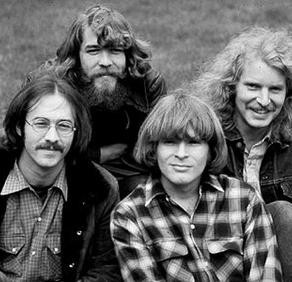

# Creedence Clearwater Revival

## Artist Profile

Creedence Clearwater Revival (often known as "CCR") were an American rock band, active 1967–1972, formed by John Fogerty (Vocals And Guitar), Tom Fogerty (Rhythm Guitar), Stu Cook (Bass), and Doug "Cosmo" Clifford (Drums). Despite being from Berkeley, California, the band's music usually invoked imagery of the American South.

John Fogerty, Stu Cook, and Doug Clifford initially joined forces in 1959 as The Blue Velvets and later backed John's older brother, Tom, as Tommy Fogerty and the Blue Velvets. The group later changed their name to the Golliwogs and released several unsuccessful singles. In 1967, they changed their name to Creedence Clearwater Revival and John Fogerty took total control of the group. CCR was extremely prolific, releasing 6 albums and various singles between 1968 and 1970. However, the other members of the band chafed under John Fogerty's domination and in 1971 it was announced that Tom Fogerty had left the band. CCR made one more album, 1972's "Mardi Gras", as a trio. In the wake of Tom's departure, John, responding the other members' requests to have more say in band matters, stipulated that both Cook and Clifford had to contribute equally to the writing and recording. The album was poorly received and CCR subsequently split.

In the years following their split, the animosities between John and the other members grew. When the group was inducted into the Rock and Roll Hall Of Fame in 1993, John infamously barred Cook and Clifford from the stage (Tom had passed away in 1990). In 1995, Cook and Clifford formed Creedence Clearwater Revisited.

## Artist Links

- [https://creedenceclearwaterrevival.bandcamp.com/](https://creedenceclearwaterrevival.bandcamp.com/)
- [https://www.facebook.com/CCR](https://www.facebook.com/CCR)
- [https://www.imdb.com/name/nm2045052/](https://www.imdb.com/name/nm2045052/)
- [https://www.instagram.com/theofficialccr/](https://www.instagram.com/theofficialccr/)
- [https://twitter.com/theofficialCCR](https://twitter.com/theofficialCCR)
- [https://en.wikipedia.org/wiki/Creedence_Clearwater_Revival](https://en.wikipedia.org/wiki/Creedence_Clearwater_Revival)
- [https://www.youtube.com/channel/UCZodL_lPCDt6BT5Co7r3rdQ](https://www.youtube.com/channel/UCZodL_lPCDt6BT5Co7r3rdQ)

## See also

- [Cosmo's Factory](Cosmos_Factory.md)
- [Green River](Green_River.md)
- [Willy And The Poor Boys](Willy_And_The_Poor_Boys.md)
