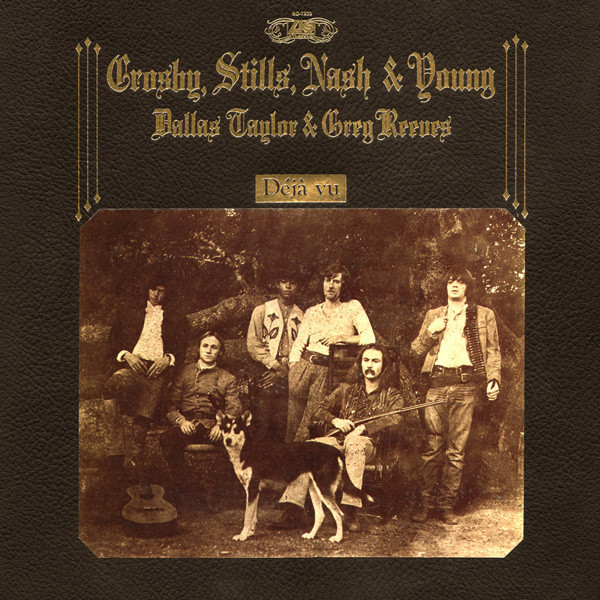

# Déjà Vu

By Crosby, Stills, Nash & Young

## Album Data

[Discogs URL](https://www.discogs.com/release/1132195-Crosby-Stills-Nash-Young-D%C3%A9j%C3%A0-Vu)

- Label: Atlantic
- Formats: Vinyl, LP, Album, Stereo
- Genres: Rock, Folk Rock, Country Rock
- Rating: 4.35
- Released: 1970-03-11
- Year: 1970
- Release ID: 1132195
- Media condition: 
- Sleeve condition: 
- Speed: 
- Weight: 
- Notes: 

## Album Tracks

| **Position** | **Title** | **Duration** |
|--------------|-----------|--------------|
| A1 | **Carry On** | 4:25 |
| A2 | **Teach Your Children** | 2:53 |
| A3 | **Almost Cut My Hair** | 4:25 |
| A4 | **Helpless** | 3:30 |
| A5 | **Woodstock** | 3:52 |
| B1 | **Deja Vu** | 4:10 |
| B2 | **Our House** | 2:59 |
| B3 | **4 + 20** | 1:55 |
|  | **Country Girl** | 5:05 |
| B5 | **Everybody I Love You** | 2:20 |

## Artist Roles

| **Name** | **Role** |
|----------|----------|
| **Gary Burden** | Art Direction, Design |
| **Greg Reeves** | Bass |
| **Elliot Roberts & Associates** | Creative Director [Direction] |
| **Bill Halverson** | Engineer |
| **Al Brown (5)** | Lacquer Cut By |
| **David Geffen** | Management [Agent & Friend] |
| **Dallas Taylor** | Percussion |
| **Tom Gundelfinger** | Photography By [Cover] |
| **Salli Sasche** | Photography By [Inside (2 In Lower Right Corner)] |
| **Henry Diltz** | Photography By [Inside] |
| **David Crosby** | Producer |
| **Graham Nash** | Producer |
| **Neil Young** | Producer |
| **Stephen Stills** | Producer |

