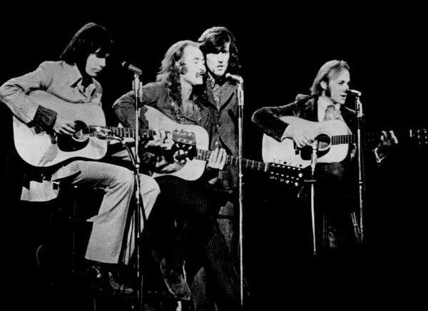

# Crosby, Stills, Nash & Young

## Artist Profile

Crosby, Stills, Nash & Young (CSNY) was the name given to vocal folk rock supergroup Crosby, Stills &amp; Nash when joined by Canadian singer-songwriter Neil Young, who was an occasional fourth member.

## Artist Links

- [https://www.csny.com/](https://www.csny.com/)
- [https://www.crosbystillsnash.com/](https://www.crosbystillsnash.com/)
- [https://en.wikipedia.org/wiki/Crosby,_Stills,_Nash_%26_Young](https://en.wikipedia.org/wiki/Crosby,_Stills,_Nash_%26_Young)
- [https://rateyourmusic.com/artist/crosby-stills-nash-and-young](https://rateyourmusic.com/artist/crosby-stills-nash-and-young)

## See also

- [Déjà Vu](Déjà_Vu.md)
- [Teach Your Children / Carry On](Teach_Your_Children_-_Carry_On.md)
