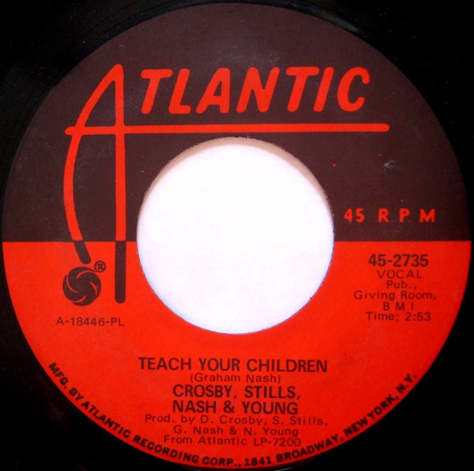

# Teach Your Children / Carry On

By Crosby, Stills, Nash & Young

## Album Data

[Discogs URL](https://www.discogs.com/release/1999569-Crosby-Stills-Nash-Young-Teach-Your-Children-Carry-On)

- Label: Atlantic
- Formats: Vinyl, 7", Single, 45 RPM
- Genres: Rock, Folk Rock
- Rating: 3.91
- Released: 1970
- Year: 1970
- Release ID: 1999569
- Media condition: 
- Sleeve condition: 
- Speed: 
- Weight: 
- Notes: 

## Album Tracks

| **Position** | **Title** | **Duration** |
|--------------|-----------|--------------|
| A | **Teach Your Children** | 2:53 |
| B | **Carry On** | 4:25 |

## Artist Roles

| **Name** | **Role** |
|----------|----------|
| **Dennis King** | Lacquer Cut By |
| **Crosby, Stills, Nash & Young** | Producer [Prod. By] |

