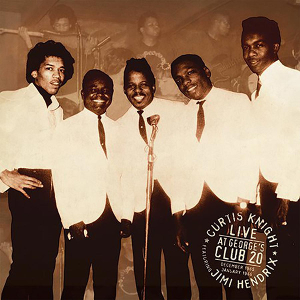

# Live At George's Club 20

By Curtis Knight

## Album Data

[Discogs URL](https://www.discogs.com/release/10172447-Curtis-Knight-Featuring-Jimi-Hendrix-Live-At-Georges-Club-20)

- Label: Dagger Records
Sony Music
- Formats: Vinyl, LP, Compilation
- Genres: Rock, Funk / Soul, Rhythm & Blues
- Rating: 4.33
- Released: 2017-04-22
- Year: 2017
- Release ID: 10172447
- Media condition: 
- Sleeve condition: 
- Speed: 
- Weight: 
- Notes: 

## Album Tracks

| **Position** | **Title** | **Duration** |
|--------------|-----------|--------------|
| A1 | **Introduction** | 0:41 |
| A2 | **Killing Floor** | 3:22 |
| A3 | **Last Night** | 2:24 |
| A4 | **Get Out Of My Life Woman** | 3:48 |
| A5 | **Ain't That Peculiar** | 4:24 |
| B1 | **Mercy, Mercy** | 3:30 |
| B2 | **I'm A Man** | 5:17 |
| B3 | **Driving South** | 6:03 |
| B4 | **Baby What You Want Me To Do** | 3:47 |
| C1 | **I'll Be Doggone** | 2:57 |
| C2 | **Sweet Little Angel** | 4:33 |
| C3 | **Let's Go, Let's Go, Let's Go** | 3:55 |
| C4 | **Travelin' To California** | 4:30 |
| D1 | **What I Say** | 4:52 |
| D2 | **Land Of 1000 Dances** | 4:38 |
| D3 | **Come On (Let The Good Times Roll)** | 4:10 |
| D4 | **Band Outro** | 0:57 |

## Artist Roles

| **Name** | **Role** |
|----------|----------|
| **Eddie Kramer** | Compilation Producer |
| **Janie Hendrix** | Compilation Producer |
| **John McDermott** | Compilation Producer |
| **Bernie Grundman** | Lacquer Cut By |
| **John McDermott** | Liner Notes |

