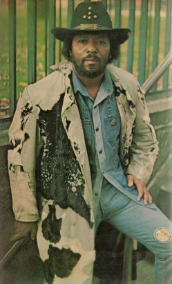

# Curtis Knight

## Artist Profile

Curtis Knight (May 9, 1929 - November 29, 1999) was born Mont Curtis McNear. An American musician and writer he was closely associated with Jimi Hendrix who he performed with. Knight wrote two books about him; Starchild and Jimi: An Intimate Biography Of Jimi Hendrix. Between 1973 and 1974 he also fronted Curtis Knight Zeus.

## Artist Links

- [http://en.wikipedia.org/wiki/Curtis_Knight](http://en.wikipedia.org/wiki/Curtis_Knight)
- [http://www.earlyhendrix.com/knight1-menu-intro](http://www.earlyhendrix.com/knight1-menu-intro)

## See also

- [Live At George's Club 20](Live_At_Georges_Club_20.md)
