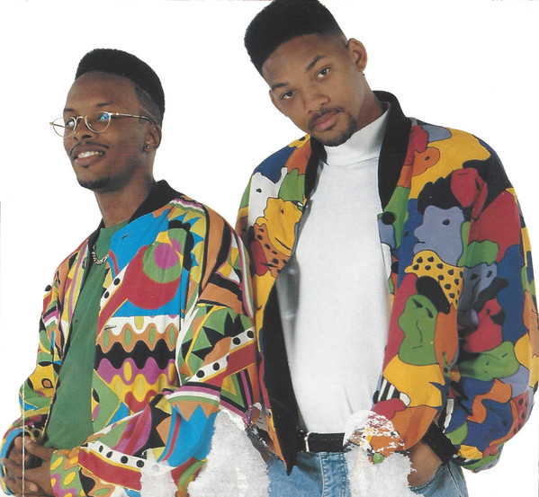

# DJ Jazzy Jeff & The Fresh Prince

## Artist Profile

Popular hip hop duo composed of Jeff Townes AKA DJ Jazzy Jeff (b. Jeffrey A. Townes, 22 January 1965, Philadelphia, Pennsylvania, USA) and Will Smith AKA The Fresh Prince (b. Willard Christopher Smith Jr., 25 September 1968, Philadelphia, Pennsylvania, USA).
Jazzy Jeff started DJing in the mid-1970's when he was a mere 10 years old, (though he is not to be confused with the similarly-titled Jazzy Jeff who cut an album, also for Jive, in 1985). 
Together with Will Smith , they became the first rap act to receive a Grammy Award for their second 12" single "Parents Just Don't Understand". 
Meanwhile, Jeff founded "A Touch Of Jazz Inc", a stable of producers working on rap/R&B projects. The duo picked up a second Grammy for "Summertime" in 1991, before scoring a shock UK number 1 in 1993 with "Boom! Shake The Room". 

## Artist Links

- [http://www.djjazzyjeff.com](http://www.djjazzyjeff.com)
- [http://www.willsmith.com](http://www.willsmith.com)
- [http://www.readyrockc.com](http://www.readyrockc.com)
- [https://en.wikipedia.org/wiki/DJ_Jazzy_Jeff_%26_The_Fresh_Prince](https://en.wikipedia.org/wiki/DJ_Jazzy_Jeff_%26_The_Fresh_Prince)
- [https://books.discogs.com/credit/731312-dj-jazzy-jeff-the-fresh-prince](https://books.discogs.com/credit/731312-dj-jazzy-jeff-the-fresh-prince)

## See also

- [Parents Just Don't Understand](Parents_Just_Dont_Understand.md)
