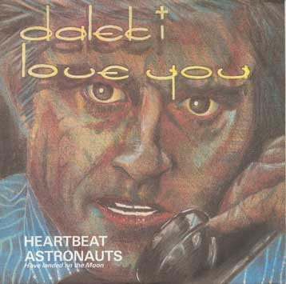

# Heartbeat

By Dalek I

## Album Data

[Discogs URL](https://www.discogs.com/release/1636566-Dalek-I-Love-You-Heartbeat)

- Label: Back Door
- Formats: Vinyl, 7", 45 RPM, Single
- Genres: Electronic, Rock, New Wave, Synth-pop
- Rating: 4.13
- Released: 1981-02-28
- Year: 1981
- Release ID: 1636566
- Media condition: 
- Sleeve condition: 
- Speed: 
- Weight: 
- Notes: 

## Album Tracks

| **Position** | **Title** | **Duration** |
|--------------|-----------|--------------|
| A | **Heartbeat** | 3:20 |
| B | **Astronauts (Have Landed On The Moon)** | 3:21 |

## Artist Roles

| **Name** | **Role** |
|----------|----------|
| **Merrick** | Drums |
| **Nick Bradford** | Engineer [Mixing Engineer At Matrix] |
| **Tony Bridge** | Lacquer Cut By [Runout A] |
| **Chris Hughes** | Mixed By |
| **David Bates** | Mixed By |
| **Nick Bradford** | Mixed By |
| **Alan Gill** | Producer |
| **Chris Hughes** | Producer |
| **Alan Jones (8)** | Recorded By |
| **Alan Gill** | Vocals [Vocal], Synthesizer [Synthesiser], Bass |
| **Chuka Russo** | Voice [Vocal Harmonies] |
| **Hugh Jones** | Voice [Vocal Harmonies] |
| **Alan Gill** | Written-By |

