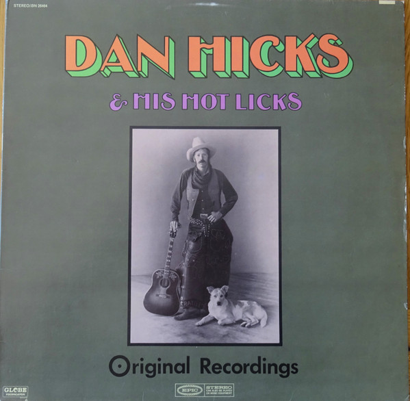

# Original Recordings

By Dan Hicks And His Hot Licks

## Album Data

[Discogs URL](https://www.discogs.com/release/4339301-Dan-Hicks-His-Hot-Licks-Original-Recordings)

- Label: Epic
- Formats: Vinyl, LP, Album, Stereo
- Genres: Jazz, Rock, Folk, World, & Country, Folk Rock
- Rating: 3.74
- Released: 1969
- Year: 1969
- Release ID: 4339301
- Media condition: 
- Sleeve condition: 
- Speed: 
- Weight: 
- Notes: 

## Album Tracks

| **Position** | **Title** | **Duration** |
|--------------|-----------|--------------|
| A1 | **Canned Music** | 4:02 |
| A2 | **How Can I Miss You When You Won't Go Away?** | 2:38 |
| A3 | **I Scare Myself** | 5:20 |
| A4 | **Shorty Takes A Dive** | 3:10 |
| A5 | **Evenin' Breeze** | 3:55 |
| B1 | **Waitin' For The "103"** | 3:43 |
| B2 | **Shorty Falls In Love** | 3:23 |
| B3 | **Milk Shakin' Mama** | 4:08 |
| B4 | **Slow Movin'** | 3:05 |
| B5 | **It's Bad Grammar, Baby** | 2:20 |
| B6 | **Jukies' Ball** | 4:38 |

## Artist Roles

| **Name** | **Role** |
|----------|----------|
| **Jaime Leopold** | Double Bass [Bull Fiddle] |
| **Jon Weber (2)** | Lead Guitar |
| **Bob Johnston** | Producer |
| **Sid Page** | Violin |
| **Sherry Snow** | Vocals |
| **Christina Viola Gancher** | Vocals, Celesta [Celeste], Piano |
| **Dan Hicks** | Vocals, Rhythm Guitar, Harmonica, Drums |

