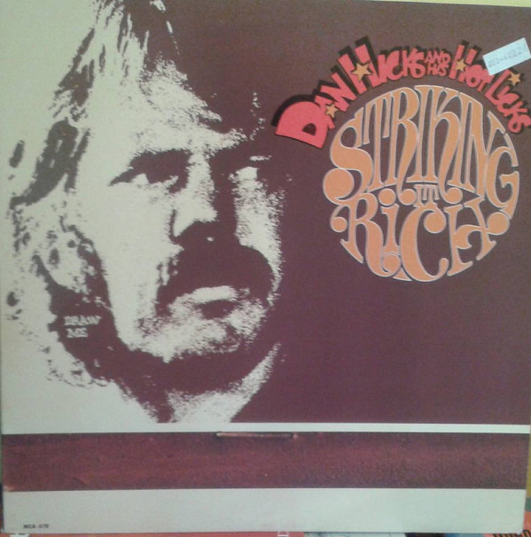

# Striking It Rich!

By Dan Hicks And His Hot Licks

## Album Data

[Discogs URL](https://www.discogs.com/release/4740225-Dan-Hicks-His-Hot-Licks-Striking-It-Rich)

- Label: MCA Records
- Formats: Vinyl, LP, Album, Reissue
- Genres: Rock, Blues Rock
- Rating: 4.18
- Released: 1980
- Year: 1972
- Release ID: 4740225
- Media condition: 
- Sleeve condition: 
- Speed: 
- Weight: 
- Notes: 

## Album Tracks

| **Position** | **Title** | **Duration** |
|--------------|-----------|--------------|
| A1 | **You Got To Believe** | 2:54 |
| A2 | **Walkin' One And Only** | 2:45 |
| A3 | **O'Reilly At The Bar** | 2:50 |
| A4 | **Moody Richard (The Innocent Bystander)** | 4:00 |
| A5 | **Flight Of The Fly** | 2:35 |
| A6 | **I Scare Myself** | 5:36 |
| A7 | **Philly Rag** | 0:35 |
| B1 | **The Laughing Song** | 2:58 |
| B2 | **Canned Music** | 3:33 |
| B3 | **I'm An Old Cowhand (From The Rio Grande)** | 2:52 |
| B4 | **Woe The Luck** | 5:02 |
| B5 | **Presently In The Past** | 3:10 |
| B6 | **Skippy's Farewell** | 0:59 |
| B7 | **Furiyama** | 0:38 |

## Artist Roles

| **Name** | **Role** |
|----------|----------|
| **Tommy LiPuma** | Producer |

