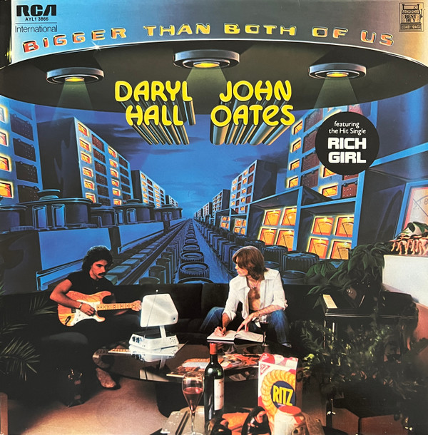

# Bigger Than Both Of Us

By Daryl Hall & John Oates

## Album Data

[Discogs URL](https://www.discogs.com/release/775045-Daryl-Hall-John-Oates-Bigger-Than-Both-Of-Us)

- Label: RCA Victor
- Formats: Vinyl, LP, Album, Stereo
- Genres: Rock, Pop, Pop Rock
- Rating: 3.64
- Released: 1976
- Year: 1976
- Release ID: 775045
- Media condition: 
- Sleeve condition: 
- Speed: 
- Weight: 
- Notes: 

## Album Tracks

| **Position** | **Title** | **Duration** |
|--------------|-----------|--------------|
| A1 | **Back Together Again** | 3:23 |
| A2 | **Rich Girl** | 2:23 |
| A3 | **Crazy Eyes** | 3:07 |
| A4 | **Do What You Want, Be What You Are** | 4:35 |
| A5 | **Kerry** | 3:47 |
| B1 | **London Luck, & Love** | 2:56 |
| B2 | **Room To Breathe** | 4:09 |
| B3 | **You'll Never Learn** | 4:12 |
| B4 | **Falling** | 6:13 |

## Artist Roles

| **Name** | **Role** |
|----------|----------|
| **Daryl Hall & John Oates** | Arranged By |
| **Leland Sklar** | Bass |
| **Scott Edwards (2)** | Bass |
| **James Getzoff** | Concertmaster |
| **Daryl Hall** | Cover [Concept], Cover [Design] |
| **Ed Greene (2)** | Drums |
| **Jim Gordon** | Drums |
| **John Arrias** | Engineer |
| **John Mills (2)** | Engineer |
| **Armin Steiner** | Engineer [Strings] |
| **John Oates** | Guitar, Harmonica, Vocals |
| **Ron Barrey** | Illustration [Illustrated By] |
| **Daryl Hall** | Keyboards, Mandolin [Mandola], Synthesizer, Vocals, Design, Artwork [Cover Concept] |
| **Christopher Bond** | Lead Guitar, Keyboards, Synthesizer |
| **Tommy Mottola** | Management |
| **Allen Zentz** | Mastered By |
| **Gary Coleman** | Percussion |
| **Gribbitt!** | Photography By [Cover] |
| **Kathy Hohl** | Photography By [Insert] |
| **Sam Emerson** | Photography By [Insert] |
| **Tom Hensley** | Piano |
| **Christopher Bond** | Producer, Arranged By, Arranged By [Strings] |
| **Tom Scott** | Saxophone, Flute, Lyricon |

