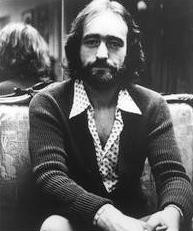

# Dave Mason

## Artist Profile

English singer-songwriter and guitarist born May 10, 1946 in Worcester, UK. Co-founder of seminal group Traffic, Rock and Roll Hall of Fame Inductee.

Mason's tenure with Traffic was disjointed. He was a founding member of the group, but left following the release of their debut album, Mr. Fantasy (1967), only to rejoin halfway through the sessions for their next album, Traffic (1968), after which he left again. Last Exit (1969), a compilation of odds and ends, features little material by Mason apart from his song "Just for You". Traffic later re-formed without Mason, although he briefly began working with the band for a third time, touring with them in 1971 and playing on Welcome to the Canteen. In his brief spells with the group, Mason never quite fit in; Steve Winwood later recalled. In 1970, Mason was slated to be the second guitarist for Derek and the Dominos. He played on their early studio sessions, including the Phil Spector production of "Tell the Truth", which was later withdrawn from sale (and is now a collectors item). He also played at their first gig at the London Lyceum but left the group soon after that. 

For a brief period in the mid 1990s, Mason joined Fleetwood Mac and released the album Time with them in 1995. He toured with them over the course of 1994–95. Over the course of his career, Mason has played and recorded with many notable pop and rock musicians, including Jimi Hendrix, the Rolling Stones (e.g. on Street Fighting Man), George Harrison (appearing on All Things Must Pass), Paul McCartney, Eric Clapton, Michael Jackson, David Crosby, Graham Nash, Steve Winwood, Fleetwood Mac, Delaney & Bonnie, Leon Russell and Cass Elliot. One of Mason's best known songs is "Feelin' Alright", recorded by Traffic in 1968 and later by many other performers, including Joe Cocker, whose version of the song was a hit in 1969. For Traffic, he also wrote "Hole in My Shoe", a psychedelic pop song that became a hit in its own right. "We Just Disagree", Mason's 1977 solo US hit, written by Jim Krueger, has become a staple of US classic hits and adult contemporary radio playlists.

In 2004, Mason was inducted into the Rock and Roll Hall of Fame as a founding member of Traffic. Within the same year, Mason started a new electric guitar company with business partner and industrial designer Ravi Sawhney.

## Artist Links

- [https://www.davemasonmusic.com/](https://www.davemasonmusic.com/)
- [https://www.facebook.com/DaveMasonMusic](https://www.facebook.com/DaveMasonMusic)
- [https://en.wikipedia.org/wiki/Dave_Mason](https://en.wikipedia.org/wiki/Dave_Mason)

## See also

- [Dave Mason](Dave_Mason.md)
