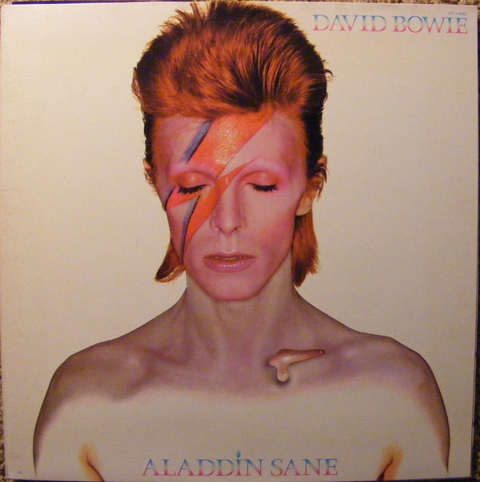

# Aladdin Sane

By David Bowie

## Album Data

[Discogs URL](https://www.discogs.com/release/2080547-David-Bowie-Aladdin-Sane)

- Label: RCA Victor
- Formats: Vinyl, LP, Album, Reissue, Repress
- Genres: Rock, Rock & Roll, Glam
- Rating: 4.42
- Released: 1980
- Year: 1973
- Release ID: 2080547
- Media condition: 
- Sleeve condition: 
- Speed: 
- Weight: 
- Notes: 

## Album Tracks

| **Position** | **Title** | **Duration** |
|--------------|-----------|--------------|
| A1 | **Watch That Man** | 4:25 |
| A2 | **Aladdin Sane (1913-1938-197?)** | 5:06 |
| A3 | **Drive-In Saturday** | 4:29 |
| A4 | **Panic In Detroit** | 4:25 |
| A5 | **Cracked Actor** | 2:56 |
| B1 | **Time** | 5:09 |
| B2 | **The Prettiest Star** | 3:26 |
| B3 | **Let's Spend The Night Together** | 3:03 |
| B4 | **The Jean Genie** | 4:02 |
| B5 | **Lady Grinning Soul** | 3:46 |

## Artist Roles

| **Name** | **Role** |
|----------|----------|
| **David Bowie** | Arranged By |
| **Mick Ronson** | Arranged By |
| **Geoff Maccormack** | Backing Vocals |
| **Juanita Franklin** | Backing Vocals |
| **Linda Lewis** | Backing Vocals |
| **Trevor Bolder** | Bass |
| **Brian Duffy (3)** | Design [Album Cover] |
| **Celia Philo** | Design [Album Cover] |
| **Mick Woodmansey** | Drums |
| **Ken Scott** | Engineer |
| **Mike Moran (7)** | Engineer |
| **Pierre Laroche** | Make-Up |
| **Ken Scott** | Mixed By |
| **Mick Ronson** | Mixed By |
| **David Bowie** | Performer [Played By] |
| **Mick Ronson** | Performer [Played By] |
| **Mike Garson** | Piano |
| **David Bowie** | Producer |
| **Ken Scott** | Producer |
| **Brian Wilshaw** | Saxophone, Flute |
| **Ken Fordham** | Saxophone, Flute |
| **David Bowie** | Written-By |

