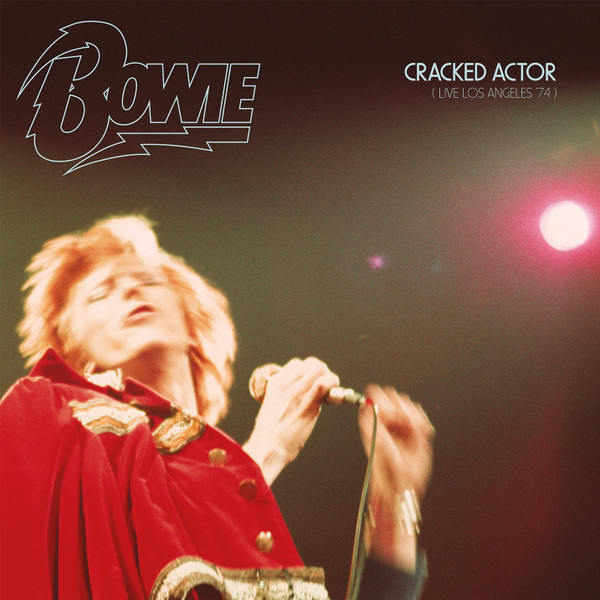

# Cracked Actor (Live Los Angeles '74)

By David Bowie

## Album Data

[Discogs URL](https://www.discogs.com/release/10144116-Bowie-Cracked-Actor-Live-Los-Angeles-74)

- Label: Parlophone
Parlophone
- Formats: Vinyl
Vinyl
All Media, LP, LP, Single Sided, Etched, Album, Limited Edition
- Genres: Rock, Funk / Soul, Glam, Soul, Pop Rock
- Rating: 4.57
- Released: 2017-04-22
- Year: 2017
- Release ID: 10144116
- Media condition: 
- Sleeve condition: 
- Speed: 
- Weight: 
- Notes: 

## Album Tracks

| **Position** | **Title** | **Duration** |
|--------------|-----------|--------------|
| A1 | **Introduction** | 1:47 |
| A2 | **1984** | 2:55 |
| A3 | **Rebel Rebel** | 2:31 |
| A4 | **Moonage Daydream** | 5:17 |
| A5 | **Sweet Thing / Candidate / Sweet Thing (Reprise)** | 7:41 |
| B1 | **Changes** | 3:47 |
| B2 | **Suffragette City** | 3:49 |
| B3 | **Aladdin Sane** | 5:01 |
| B4 | **All The Young Dudes** | 4:09 |
| B5 | **Cracked Actor** | 3:20 |
| C1 | **Rock 'N' Roll With Me** | 4:54 |
| C2 | **Knock On Wood** | 3:16 |
| C3 | **It's Gonna Be Me** | 7:11 |
| C4 | **Space Oddity** | 5:23 |
| D1 | **Diamond Dogs** | 6:58 |
| D2 | **Big Brother** | 4:05 |
| D3 | **Time** | 5:44 |
| E1 | **The Jean Genie** | 5:45 |
| E2 | **Rock 'N' Roll Suicide** | 5:10 |
| E3 | **John, I'm Only Dancing (Again)** | 8:41 |

## Artist Roles

| **Name** | **Role** |
|----------|----------|
| **David Sanborn** | Alto Saxophone, Flute |
| **Anthony Hinton** | Backing Vocals |
| **Ava Cherry** | Backing Vocals |
| **Diane Sumler** | Backing Vocals |
| **Luther Vandross** | Backing Vocals |
| **Robin Clark (2)** | Backing Vocals |
| **Warren Peace** | Backing Vocals |
| **Richard Grando** | Baritone Saxophone, Flute |
| **Doug Rauch** | Bass |
| **Pablo Rosario** | Congas |
| **Scott Minshall** | Design |
| **Greg Errico** | Drums |
| **Carlos Alomar** | Guitar |
| **Earl Slick** | Guitar |
| **Ray Staff** | Mastered By |
| **Tony Visconti** | Mixed By |
| **Jaime Andrews** | Photography By [Front Cover & Centre Spread] |
| **Terry O'Neill (2)** | Photography By [Inside Panel & Back Cover] |
| **Mike Garson** | Piano, Mellotron |
| **David Bowie** | Producer |
| **Aisha Cohen** | Producer [Project Produced For Release By For RZO Music] |
| **Nigel Reeve** | Producer [Project Produced For Release By For Warner Music] |
| **Olivia Thomas** | Producer [Project Produced For Release By For Warner Music] |
| **David Bowie** | Vocals, Guitar, Harmonica |
| **David Bowie** | Written-By |
| **Eddie Floyd** | Written-By |
| **Steve Cropper** | Written-By |
| **Warren Peace** | Written-By |

