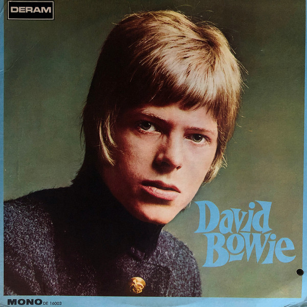

# David Bowie

By David Bowie

## Album Data

[Discogs URL](https://www.discogs.com/release/8161980-David-Bowie-David-Bowie)

- Label: Parlophone
Parlophone
Parlophone
- Formats: Vinyl, LP, Album, Reissue, Remastered, Stereo
- Genres: Rock, Folk Rock, Glam
- Rating: 4.44
- Released: 2016-02-00
- Year: 1969
- Release ID: 8161980
- Media condition: 
- Sleeve condition: 
- Speed: 
- Weight: 
- Notes: 

## Album Tracks

| **Position** | **Title** | **Duration** |
|--------------|-----------|--------------|
| A1 | **Space Oddity** |  |
| A2 | **Unwashed And Somewhat Slightly Dazed** |  |
| A3 | **Letter To Hermione** |  |
| A4 | **Cygnet Committee** |  |
| B1 | **Janine** |  |
| B2 | **An Occasional Dream** |  |
| B3 | **Wild Eyed Boy From Freecloud** |  |
| B4 | **God Knows I'm Good** |  |
| B5 | **Memory Of A Free Festival** |  |

## Artist Roles

| **Name** | **Role** |
|----------|----------|
| **David Bowie** | Arranged By |
| **Paul Buckmaster** | Arranged By |
| **Tony Visconti** | Arranged By |
| **Victor Vasarely** | Artwork [Front Cover, Based On 'CTA 25 Neg'] |
| **Calvin Mark Lee** | Design Concept |
| **David Bowie** | Design Concept |
| **Vernon Dewhurst** | Design [Front Cover] |
| **Barry Sheffield** | Engineer |
| **Ken Scott** | Engineer |
| **Malcolm Toft** | Engineer |
| **George Underwood** | Illustration ['The Depth Of The Circle' Back Cover] |
| **Gus Dudgeon** | Producer [Produced By] |
| **Tony Visconti** | Producer [Produced By] |
| **David Bowie** | Vocals, Twelve-String Guitar [12 String Guitar], Stylophone, Kalimba, Organ [Rosedal Electric Chord Organ] |
| **David Bowie** | Written-By |

