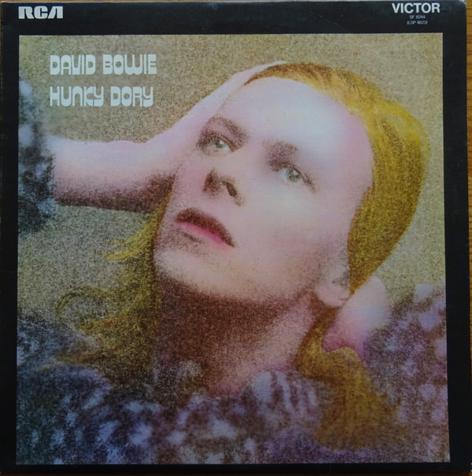

# Hunky Dory

By David Bowie

## Album Data

[Discogs URL](https://www.discogs.com/release/8162088-David-Bowie-Hunky-Dory)

- Label: Parlophone
Parlophone
Parlophone
Parlophone
- Formats: Vinyl, LP, Album, Reissue, Remastered
- Genres: Rock, Glam, Pop Rock
- Rating: 4.66
- Released: 2016-02-26
- Year: 1971
- Release ID: 8162088
- Media condition: 
- Sleeve condition: 
- Speed: 
- Weight: 
- Notes: 

## Album Tracks

| **Position** | **Title** | **Duration** |
|--------------|-----------|--------------|
| A1 | **Changes** | 2:32 |
|  | **Oh! You Pretty Things/Eight Line Poem** | 6:04 |
| A4 | **Life On Mars?** | 3:45 |
| A5 | **Kooks** | 2:45 |
| A6 | **Quicksand** | 5:03 |
|  | **Fill Your Heart/Andy Warhol** | 7:02 |
| B3 | **Song For Bob Dylan** | 4:10 |
| B4 | **Queen Bitch** | 3:14 |
| B5 | **The Bewlay Brothers** | 5:21 |

## Artist Roles

| **Name** | **Role** |
|----------|----------|
| **Mick Ronson** | Arranged By |
| **George Underwood** | Artwork [Front Cover] |
| **Terry Pastor** | Artwork [Front Cover] |
| **Trevor Bolder** | Bass |
| **Mick Woodmansey** | Drums |
| **Mick Ronson** | Guitar |
| **David Bowie** | Guitar, Saxophone, Piano |
| **Brian Ward (5)** | Photography By |
| **Rick Wakeman** | Piano |
| **Ken Scott** | Producer, Remix |
| **David Bowie** | Written-By |

