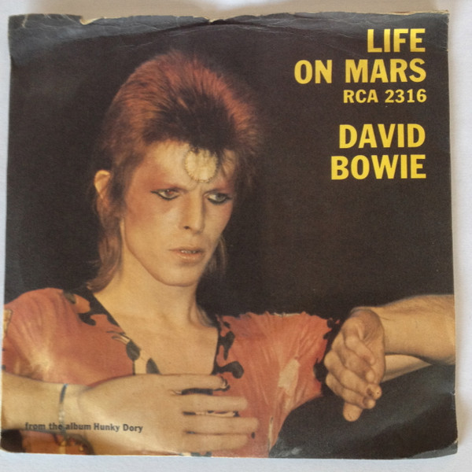

# Life On Mars?

By David Bowie

## Album Data

[Discogs URL](https://www.discogs.com/release/4672755-David-Bowie-Life-On-Mars)

- Label: EMI
- Formats: Vinyl, 7", 45 RPM, Single, Picture Disc, Remastered, Limited Edition
- Genres: Rock, Pop, Glam, Classic Rock
- Rating: 4.65
- Released: 2013-06-24
- Year: 1973
- Release ID: 4672755
- Media condition: 
- Sleeve condition: 
- Speed: 
- Weight: 
- Notes: 

## Album Tracks

| **Position** | **Title** | **Duration** |
|--------------|-----------|--------------|
| A | **Life On Mars? (2003 Ken Scott Mix)** | 3:50 |
| AA | **Life On Mars? (Live)** | 3:29 |

## Artist Roles

| **Name** | **Role** |
|----------|----------|
| **Darren Evans (2)** | Design |
| **Ray Staff** | Mastered By |
| **Mick Rock** | Photography By |
| **David Bowie** | Written-By |

