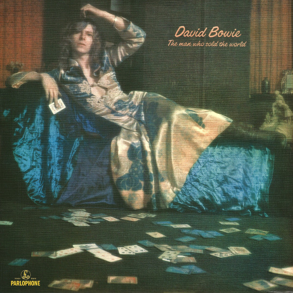

# The Man Who Sold The World

By David Bowie

## Album Data

[Discogs URL](https://www.discogs.com/release/8162132-David-Bowie-The-Man-Who-Sold-The-World)

- Label: Parlophone
Parlophone
Parlophone
- Formats: Vinyl, LP, Album, Reissue, Remastered, Stereo
- Genres: Rock, Glam
- Rating: 4.5
- Released: 2016-02-26
- Year: 1970
- Release ID: 8162132
- Media condition: 
- Sleeve condition: 
- Speed: 
- Weight: 
- Notes: 

## Album Tracks

| **Position** | **Title** | **Duration** |
|--------------|-----------|--------------|
| A1 | **The Width Of A Circle** | 8:07 |
| A2 | **All The Madmen** | 5:38 |
| A3 | **Black Country Rock** | 3:33 |
| A4 | **After All** | 3:52 |
| B1 | **Running Gun Blues** | 3:12 |
| B2 | **Saviour Machine** | 4:27 |
| B3 | **She Shook Me Cold** | 4:13 |
| B4 | **The Man Who Sold The World** | 3:58 |
| B5 | **The Supermen** | 3:39 |

## Artist Roles

| **Name** | **Role** |
|----------|----------|
| **Keef (4)** | Design, Photography By |
| **Mick Woodmansey** | Drums |
| **Tony Visconti** | Electric Bass, Piano, Guitar |
| **Ken Scott** | Engineer |
| **Mick Ronson** | Guitar |
| **David Bowie** | Guitar, Vocals |
| **Tony Visconti** | Producer [Produced By] |
| **Ralph Mace** | Synthesizer [Moog Synthesizer] |
| **David Bowie** | Written-By |

