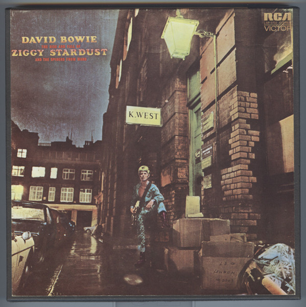

# The Rise And Fall Of Ziggy Stardust And The Spiders From Mars

By David Bowie

## Album Data

[Discogs URL](https://www.discogs.com/release/910031-David-Bowie-The-Rise-And-Fall-Of-Ziggy-Stardust-And-The-Spiders-From-Mars)

- Label: RCA Victor
- Formats: Vinyl, LP, Album, Reissue
- Genres: Rock, Classic Rock, Glam
- Rating: 4.54
- Released: 1977
- Year: 1972
- Release ID: 910031
- Media condition: 
- Sleeve condition: 
- Speed: 
- Weight: 
- Notes: 

## Album Tracks

| **Position** | **Title** | **Duration** |
|--------------|-----------|--------------|
| A1 | **Five Years** |  |
| A2 | **Soul Love** |  |
| A3 | **Moonage Daydream** |  |
| A4 | **Starman** |  |
| A5 | **It Ain't Easy** |  |
| B1 | **Lady Stardust** |  |
| B2 | **Star** |  |
| B3 | **Hang On To Yourself** |  |
| B4 | **Ziggy Stardust** |  |
| B5 | **Suffragette City** |  |
| B6 | **Rock 'N' Roll Suicide** |  |

## Artist Roles

| **Name** | **Role** |
|----------|----------|
| **David Bowie** | Arranged By |
| **Mick Ronson** | Arranged By |
| **Trevor Bolder** | Bass |
| **Mick Woodmansey** | Drums |
| **Spiders From Mars** | Featuring |
| **Mick Ronson** | Guitar, Piano, Vocals |
| **David Bowie** | Guitar, Saxophone, Vocals |
| **David Bowie** | Producer |
| **Ken Scott** | Producer |

