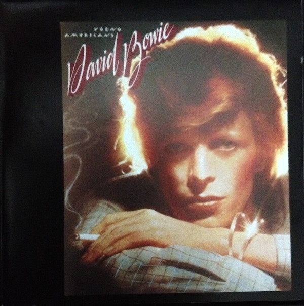

# Young Americans

By David Bowie

## Album Data

[Discogs URL](https://www.discogs.com/release/9646470-David-Bowie-Young-Americans)

- Label: Parlophone
Parlophone
Parlophone
- Formats: Vinyl, LP, Album, Reissue, Remastered
- Genres: Rock, Pop Rock, Soul
- Rating: 4.48
- Released: 2017-02-10
- Year: 1975
- Release ID: 9646470
- Media condition: 
- Sleeve condition: 
- Speed: 
- Weight: 
- Notes: 

## Album Tracks

| **Position** | **Title** | **Duration** |
|--------------|-----------|--------------|
| A1 | **Young Americans** | 5:10 |
| A2 | **Win** | 4:44 |
| A3 | **Fascination** | 5:43 |
| A4 | **Right** | 4:13 |
| B1 | **Somebody Up There Likes Me** | 6:30 |
| B2 | **Across The Universe** | 4:30 |
| B3 | **Can You Hear Me** | 5:04 |
| B4 | **Fame** | 4:12 |

## Artist Roles

| **Name** | **Role** |
|----------|----------|
| **Tony Visconti** | Arranged By [String Arrangements] |
| **David Bowie** | Arranged By [Vocal Arrangements] |
| **Luther Vandross** | Arranged By [Vocal Arrangements] |
| **Anthony Hinton** | Backing Vocals |
| **Ava Cherry** | Backing Vocals |
| **Diane Sumler** | Backing Vocals |
| **Jean Fineberg** | Backing Vocals |
| **Jean Millington** | Backing Vocals |
| **John Lennon** | Backing Vocals |
| **Luther Vandross** | Backing Vocals |
| **Robin Clark (2)** | Backing Vocals |
| **Warren Peace** | Backing Vocals |
| **Emir Ksasan** | Bass |
| **Willie Weeks** | Bass |
| **Andy Newmark** | Drums |
| **Dennis Davis** | Drums |
| **Carl Paruolo** | Engineer |
| **Eddie Kramer** | Engineer |
| **Harry Maslin** | Engineer |
| **Carlos Alomar** | Guitar |
| **Earl Slick** | Guitar |
| **John Lennon** | Guitar |
| **David Bowie** | Guitar, Keyboards, Backing Vocals |
| **Mike Garson** | Keyboards |
| **Larry Washington** | Percussion |
| **Pablo Rosario** | Percussion |
| **Ralph MacDonald** | Percussion |
| **Eric Stephen Jacobs** | Photography By [Cover Photograph] |
| **David Bowie** | Producer, Mixed By |
| **Harry Maslin** | Producer, Mixed By |
| **Tony Visconti** | Producer, Mixed By |
| **David Sanborn** | Saxophone |
| **Dave Wittman** | Tape Op [Tape Operator] |
| **David Thoener** | Tape Op [Tape Operator] |
| **Kevin Herron** | Tape Op [Tape Operator] |
| **Michael Hutchinson** | Tape Op [Tape Operator] |

