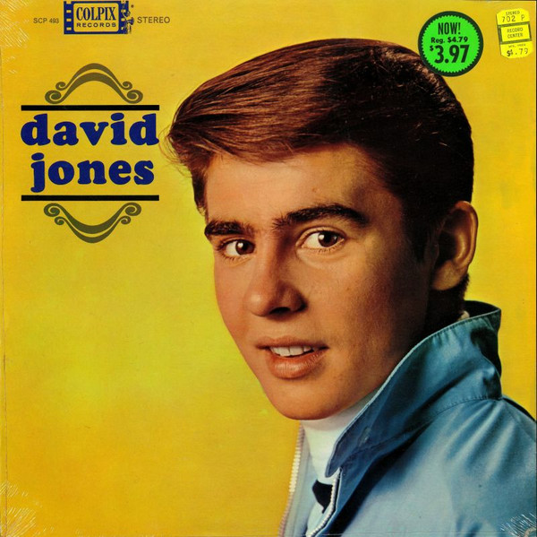

# David Jones

By Davy Jones

## Album Data

[Discogs URL](https://www.discogs.com/release/2912492-David-Jones-David-Jones)

- Label: Colpix Records
Colpix Records
Colpix Records
- Formats: Vinyl, LP, Album, Stereo
- Genres: Pop, Vocal, Ballad
- Rating: 3.6
- Released: 1965
- Year: 1965
- Release ID: 2912492
- Media condition: 
- Sleeve condition: 
- Speed: 
- Weight: 
- Notes: 

## Album Tracks

| **Position** | **Title** | **Duration** |
|--------------|-----------|--------------|
| A1 | **What Are We Going To Do?** | 2:23 |
| A2 | **Maybe It's Because I'm A Londoner** | 2:04 |
| A3 | **Put Me Amongst The Girls** | 3:27 |
| A4 | **Any Old Iron** | 2:00 |
| A5 | **Theme For A New Love** | 2:19 |
| B1 | **It Ain't Me Babe** | 2:34 |
| B2 | **Face Up To It** | 2:23 |
| B3 | **Dream Girl** | 2:17 |
| B4 | **Baby It's Me** | 2:00 |
| B5 | **My Dad** | 2:35 |
| B6 | **This Bouquet** | 2:10 |

## Artist Roles

| **Name** | **Role** |
|----------|----------|
| **Hank Levine** | Producer, Arranged By |

