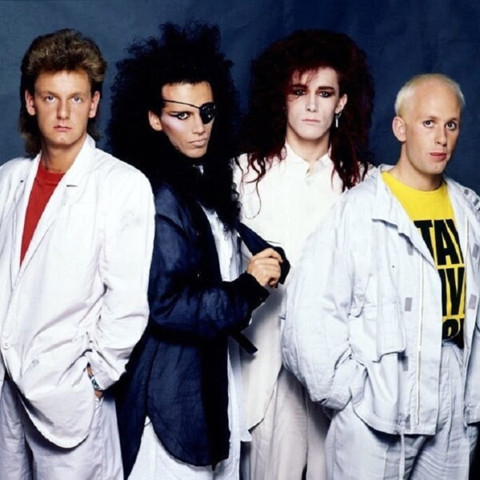

# Dead Or Alive

## Artist Profile

Formed: 1980 in Liverpool, Merseyside, United Kingdom 
Found international success with "You Spin Me Round (Like a Record)"
They had a massive following in Japan.
Members: 
Pete Burns (vocals, 1980-2016)
Steve Coy (drums 1981-2018)
Timothy Lever (keyboards, 1983-89)
Michael Percy (bass, 1981-89)
Sue James (bass, 1980-81)
Joe Musker (drums, 1980-82)
Ming (guitar, 1980)
Wayne Hussey (guitar, 1981-83)
Martin Healy (keyboards, 1980-83)
Adrian Mitchell (guitar, 1980-81) 
Jason Alburey (keyboards, 1996-2003)

## Artist Links

- [https://www.facebook.com/groups/152188074811522/](https://www.facebook.com/groups/152188074811522/)
- [http://en.wikipedia.org/wiki/Dead_or_Alive_%28band%29](http://en.wikipedia.org/wiki/Dead_or_Alive_%28band%29)

## See also

- [You Spin Me Round (Like A Record)](You_Spin_Me_Round_Like_A_Record.md)
