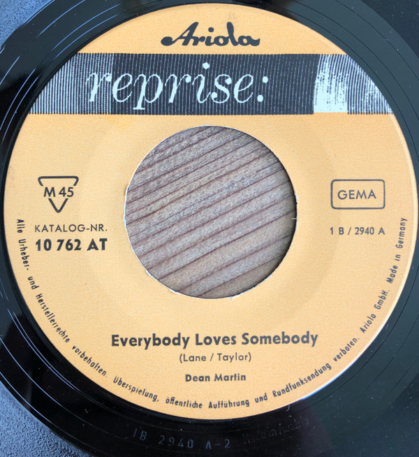

# Everybody Loves Somebody / A Little Voice

By Dean Martin

## Album Data

[Discogs URL](https://www.discogs.com/release/1577560-Dean-Martin-Everybody-Loves-Somebody-A-Little-Voice)

- Label: Reprise Records
- Formats: Vinyl, 7", 45 RPM, Single, Styrene
- Genres: Pop, Vocal
- Rating: 4.03
- Released: 1964
- Year: 1964
- Release ID: 1577560
- Media condition: 
- Sleeve condition: 
- Speed: 
- Weight: 
- Notes: 

## Album Tracks

| **Position** | **Title** | **Duration** |
|--------------|-----------|--------------|
| A | **Everybody Loves Somebody** | 2:40 |
| B | **A Little Voice** | 2:05 |

## Artist Roles

| **Name** | **Role** |
|----------|----------|
| **Ernie Freeman** | Arranged By |
| **Jimmy Bowen** | Producer [Produced By] |

