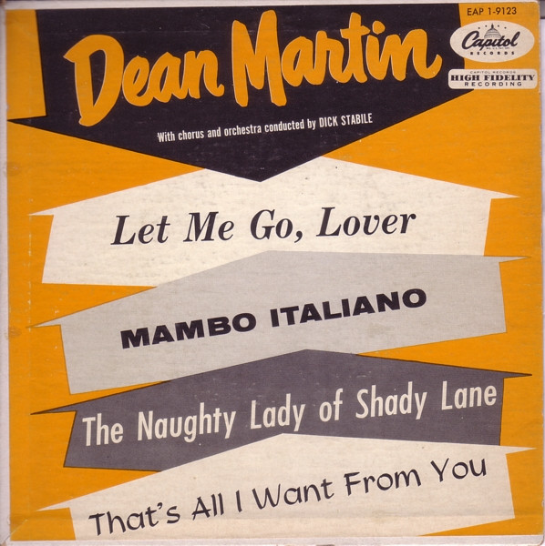

# Let Me Go, Lover

By Dean Martin

## Album Data

[Discogs URL](https://www.discogs.com/release/2516110-Dean-Martin-Let-Me-Go-Lover)

- Label: Capitol Records
- Formats: Vinyl, 7", 45 RPM, EP
- Genres: Pop, Vocal
- Rating: 4.8
- Released: 1955-02-00
- Year: 1955
- Release ID: 2516110
- Media condition: 
- Sleeve condition: 
- Speed: 
- Weight: 
- Notes: 

## Album Tracks

| **Position** | **Title** | **Duration** |
|--------------|-----------|--------------|
| A1 | **Let Me Go, Lover!** |  |
| A2 | **The Naughty Lady Of Shady Lane** |  |
| B1 | **Mambo Italiano** |  |
| B2 | **That's All I Want From You** |  |

## Artist Roles

| **Name** | **Role** |
|----------|----------|
| **Dick Stabile** | Conductor |

