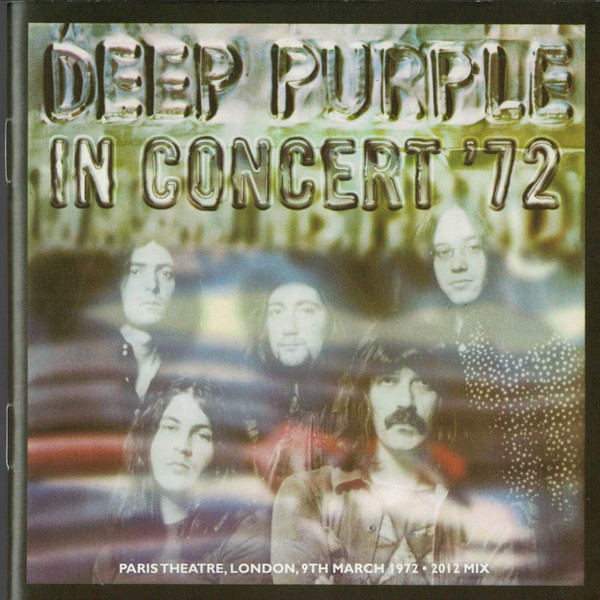

# In Concert '72

By Deep Purple

## Album Data

[Discogs URL](https://www.discogs.com/release/9114005-Deep-Purple-In-Concert-72)

- Label: Warner Bros. Records
Warner Bros. Records
- Formats: Vinyl
Vinyl, LP, Album, Reissue, 7", 33 ⅓ RPM, Single, Reissue
- Genres: Rock, Classic Rock, Hard Rock
- Rating: 4.67
- Released: 2016
- Year: 1986
- Release ID: 9114005
- Media condition: 
- Sleeve condition: 
- Speed: 
- Weight: 
- Notes: 

## Album Tracks

| **Position** | **Title** | **Duration** |
|--------------|-----------|--------------|
| A1 | **Introduction** | 0:16 |
| A2 | **Highway Star** | 7:41 |
| A3 | **Strange Kind Of Woman** | 9:32 |
| B1 | **Maybe I'm A Leo** | 5:35 |
| B2 | **Smoke On The Water** | 7:32 |
| C1 | **Never Before** | 5:18 |
| C2 | **Lazy** | 9:21 |
| D1 | **Space Truckin'** | 22:11 |
| E | **Encore: Lucille** | 7:32 |
| F | **Maybe I'm A Leo (Soundcheck)** | 4:32 |

## Artist Roles

| **Name** | **Role** |
|----------|----------|
| **Hugh Gilmour** | Art Direction |
| **Hugh Gilmour** | Design |
| **Adrian Revill** | Engineer [Original Recording] |
| **Peter Mew** | Mastered By |
| **Barry Plummer** | Photography By |
| **Mike Harding (2)** | Presenter |
| **Carol Conlon** | Producer |
| **Helen Owens** | Producer |
| **Nigel Reeve** | Producer |
| **Pete Dauncey** | Producer [Original Recording] |
| **Peter Mew** | Remix |
| **Ian Gillan** | Written-By |
| **Ian Paice** | Written-By |
| **Jon Lord** | Written-By |
| **Ritchie Blackmore** | Written-By |
| **Roger Glover** | Written-By |

