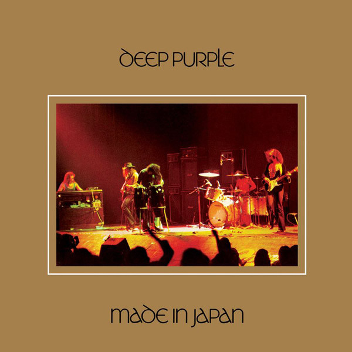

# Made In Japan

By Deep Purple

## Album Data

[Discogs URL](https://www.discogs.com/release/2552828-Deep-Purple-Made-In-Japan)

- Label: Friday Music
- Formats: Vinyl, LP, Album, Limited Edition, Reissue, Remastered
- Genres: Rock, Hard Rock, Classic Rock
- Rating: 4.61
- Released: 2010
- Year: 1972
- Release ID: 2552828
- Media condition: 
- Sleeve condition: 
- Speed: 
- Weight: 
- Notes: 

## Album Tracks

| **Position** | **Title** | **Duration** |
|--------------|-----------|--------------|
| A1 | **Highway Star** |  |
| A2 | **Child In Time** |  |
| B1 | **Smoke On The Water** |  |
| B2 | **The Mule** |  |
| C1 | **Strange Kind Of Woman** |  |
| C2 | **Lazy** |  |
| D | **Space Truckin'** |  |

## Artist Roles

| **Name** | **Role** |
|----------|----------|
| **Roger Glover** | Bass |
| **Warner Pioneer Recording Unit** | Coordinator [Co-ordination] |
| **Roger Glover** | Design [Cover Design] |
| **Ian Paice** | Drums |
| **Martin Birch** | Engineer |
| **Kevin Flegg** | Engineer [Marshall Engineer] |
| **Ron McMaster** | Lacquer Cut By |
| **Ritchie Blackmore** | Lead Guitar |
| **Joe Reagoso** | Mastered By |
| **Ian Paice** | Mixed By |
| **Roger Glover** | Mixed By |
| **Jon Lord** | Organ, Piano |
| **Fin Costello** | Photography By |
| **Deep Purple** | Producer |
| **Colin Hart (2)** | Technician [Equipment] |
| **Ian Hansford** | Technician [Equipment] |
| **Rob Cooksey** | Technician [Equipment] |
| **Ron Quinton** | Technician [Equipment] |
| **Ian Gillan** | Vocals |
| **Ian Gillan** | Written-By |
| **Ian Paice** | Written-By |
| **Jon Lord** | Written-By |
| **Ritchie Blackmore** | Written-By |
| **Roger Glover** | Written-By |

