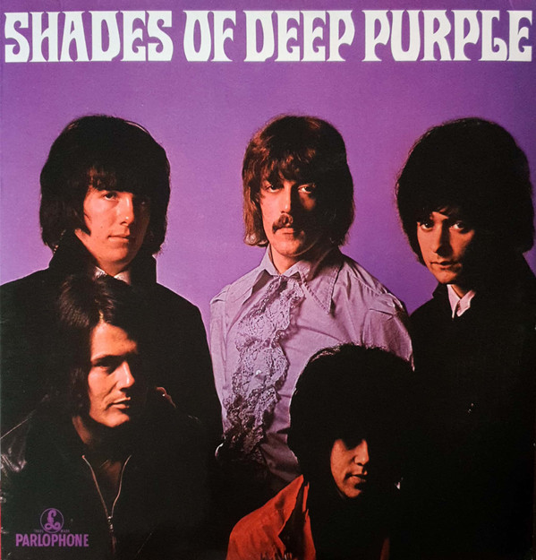

# Shades Of Deep Purple

By Deep Purple

## Album Data

[Discogs URL](https://www.discogs.com/release/7097747-Deep-Purple-Shades-Of-Deep-Purple)

- Label: Parlophone
Parlophone
- Formats: Vinyl, LP, Album, Reissue, Remastered, Stereo
- Genres: Rock, Classic Rock, Hard Rock, Psychedelic Rock, Prog Rock
- Rating: 4.37
- Released: 2015-06-08
- Year: 1968
- Release ID: 7097747
- Media condition: 
- Sleeve condition: 
- Speed: 
- Weight: 
- Notes: 

## Album Tracks

| **Position** | **Title** | **Duration** |
|--------------|-----------|--------------|
| A1 | **And The Address** |  |
| A2 | **Hush** |  |
| A3 | **One More Rainy Day** |  |
| A4a | **Prelude: Happiness** |  |
| A4b | **I'm So Glad** |  |
| B1 | **Mandrake Root** |  |
| B2 | **Help** |  |
| B3 | **Love Help Me** |  |
| B4 | **Hey Joe** |  |

## Artist Roles

| **Name** | **Role** |
|----------|----------|
| **Les Weisbrich** | Design [Cover design] |
| **Ian Paice** | Drums |
| **Barry Ainsworth** | Engineer |
| **Sean Magee** | Lacquer Cut By |
| **Ritchie Blackmore** | Lead Guitar |
| **CAB.** | Liner Notes |
| **Derek Lawrence** | Producer |
| **Rod Evans** | Vocals |
| **Nick Simper** | Vocals, Bass Guitar |
| **Jon Lord** | Vocals, Organ |

