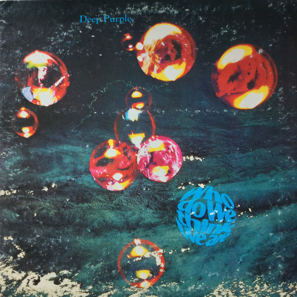

# Who Do We Think We Are

By Deep Purple

## Album Data

[Discogs URL](https://www.discogs.com/release/3147567-Deep-Purple-Who-Do-We-Think-We-Are)

- Label: Friday Music
- Formats: Vinyl, LP, Album, Reissue, Remastered
- Genres: Rock, Hard Rock, Classic Rock
- Rating: 4.52
- Released: 2009-10-27
- Year: 1973
- Release ID: 3147567
- Media condition: 
- Sleeve condition: 
- Speed: 
- Weight: 
- Notes: 

## Album Tracks

| **Position** | **Title** | **Duration** |
|--------------|-----------|--------------|
| A1 | **Woman From Tokyo** |  |
| A2 | **Mary Long** |  |
| A3 | **Super Trouper** |  |
| A4 | **Smooth Dancer** |  |
| B1 | **Rat Bat Blue** |  |
| B2 | **Place In Line** |  |
| B3 | **Our Lady** |  |

## Artist Roles

| **Name** | **Role** |
|----------|----------|
| **John Coletta** | Design [Cover Design] |
| **Roger Glover** | Design [Cover Design] |
| **Martin Birch** | Engineer |
| **Ron McMaster** | Lacquer Cut By [Runout Etch] |
| **Ian Paice** | Mixed By |
| **Roger Glover** | Mixed By |
| **Fin Costello** | Photography By [Cover Photography] |
| **Deep Purple** | Producer |
| **Joe Reagoso** | Producer [Reissue Producer] |
| **Jeremy Gee** | Recorded By [Rolling Stones Mobile Unit] |
| **Nick Watterton** | Recorded By [Rolling Stones Mobile Unit] |
| **Michael Wale** | Research [Press Research] |
| **Tony Edwards (9)** | Research [Press Research] |
| **Colin Hart (2)** | Technician [Equipment] |
| **Ian Hansford** | Technician [Equipment] |
| **Rob Cooksey** | Technician [Equipment] |
| **Ron Quinton** | Technician [Equipment] |
| **Ian Gillan** | Written-By |
| **Ian Paice** | Written-By |
| **Jon Lord** | Written-By |
| **Ritchie Blackmore** | Written-By |
| **Roger Glover** | Written-By |

