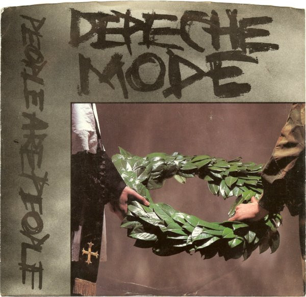

# People Are People

By Depeche Mode

## Album Data

[Discogs URL](https://www.discogs.com/release/50262-Depeche-Mode-People-Are-People)

- Label: Sire
Sire
Mute
Mute
- Formats: Vinyl, 7", 45 RPM, Single
- Genres: Electronic, Synth-pop
- Rating: 4.25
- Released: 1984
- Year: 1984
- Release ID: 50262
- Media condition: 
- Sleeve condition: 
- Speed: 
- Weight: 
- Notes: 

## Album Tracks

| **Position** | **Title** | **Duration** |
|--------------|-----------|--------------|
| A | **People Are People** | 3:43 |
| B | **In Your Memory** | 4:00 |

## Artist Roles

| **Name** | **Role** |
|----------|----------|
| **Daniel Miller** | Producer |
| **Depeche Mode** | Producer |

