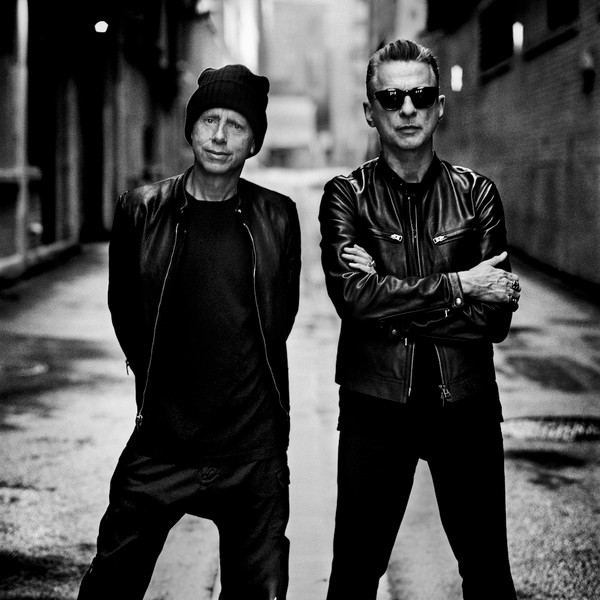

# Depeche Mode

## Artist Profile

English electronic music band formed March 1980 in Basildon, Essex, and named after a popular French fashion magazine. The group's original line-up consisted of Dave Gahan (lead vocals, occasional songwriter since 2005) Martin Gore (keyboards, guitar, vocals, chief songwriter after 1981) Andy Fletcher (keyboards) and Vince Clarke (keyboards, and chief songwriter from 1980 until 1981). 

Depeche Mode released their debut record "Speak & Spell," in 1981, bringing them into the British new-wave scene. Soon after the release of the album, Clarke decided to quit the band, leaving them to record their next album, 1982's "A Broken Frame," as a trio. Gore took over lead songwriting duties and, later in 1982, Alan Wilder (keyboards, drums, occasional songwriter) officially joined the band to fill Clarke's spot, thus establishing a line-up that would continue for the next thirteen years.

1983's groundbreaking "Construction Time Again," and 1984's "Some Great Reward," gained the band extensive popularity in the US. The subsequent releases of 1986's "Black Celebration," and 1987's "Music for the Masses," established them as a dominant force on the mainstream electronic music scene. A highlight of this era was the band's concert at the Pasadena Rose Bowl, titled "101," where they drew a crowd in excess of 60,000 people. The latter end of the US tour was recorded and released on VHS video, and was titled "101." The show itself was recorded and released as a double live album, and carried the same title.

In the new decade, Depeche Mode released 1990's "Violator," which was a massive mainstream success. The subsequent album, 1993's "Songs of Faith and Devotion," and the supporting "Devotional Tour," exacerbated tensions within the band to the point where Alan Wilder quit in 1995, leading to intense media and fan speculation that the band would split. 

Now a trio once again, the band released "Ultra," in 1997. This album was recorded during the height of Dave Gahan's near-fatal drug abuse, Martin Gore's alcoholism and seizures, along with Andrew Fletcher's bout with serious depression. For these reasons, their no worldwide tour for this album. In 1998, the band released "The Singles 81 > 85," which was a re-issue of 1985's "The Singles 81 → 85." The latter release contained "Photographic (Some Bizarre Version) & "Just Can't Get Enough (Schizo Remix)."

They also released "The Singles 86>98," and there was a subsequent world tour, titled "The Singles Tour." 

The release of 2001's "Exciter," confirmed Depeche Mode's willingness to remain together, the subsequent, and very successful. The "Exciter Tour," was their first tour in support of an original album since 1993. Again, the band did tour in 1998 to support the aforementioned "The Singles 86–98," compilation albums.

Depeche Mode have had fifty songs in the UK Singles Chart and thirteen top 10 albums in the UK charts, two of which debuted at No. 1. Depeche Mode have to this day sold over 100 million records worldwide, making them one of the most commercially successful electronic bands and one of the world's best-selling music artists. Q magazine calls Depeche Mode "the most popular electronic band the world has ever known," and included the band in the list of the "50 Bands That Changed the World!" Depeche Mode also rank number 98 on VH1's "100 Greatest Artists Of All Time."

Current lineup:
Martin L. Gore: keyboards, guitar, vocals
Dave Gahan: lead vocals

Former members:
Vince Clarke (1980-81): keyboards, backing vocals
Alan Wilder (1982-95): keyboards, drums, backing vocals
Andrew Fletcher†: (1980-2022) keyboards

## Artist Links

- [http://www.depechemode.com](http://www.depechemode.com)
- [https://www.depmod.com](https://www.depmod.com)
- [https://www.facebook.com/depechemode](https://www.facebook.com/depechemode)
- [https://www.instagram.com/depechemode](https://www.instagram.com/depechemode)
- [https://myspace.com/depechemode](https://myspace.com/depechemode)
- [https://depechemode.tumblr.com/](https://depechemode.tumblr.com/)
- [https://twitter.com/depechemode](https://twitter.com/depechemode)
- [https://vimeo.com/depechemode](https://vimeo.com/depechemode)
- [https://en.wikipedia.org/wiki/Depeche_Mode](https://en.wikipedia.org/wiki/Depeche_Mode)
- [https://www.youtube.com/channel/UC90vR_MFeheV3V6nmjvXIng](https://www.youtube.com/channel/UC90vR_MFeheV3V6nmjvXIng)
- [https://www.youtube.com/channel/UCL2ytWk3Co9Yph7Tp_dZ2lw](https://www.youtube.com/channel/UCL2ytWk3Co9Yph7Tp_dZ2lw)

## See also

- [People Are People](People_Are_People.md)
