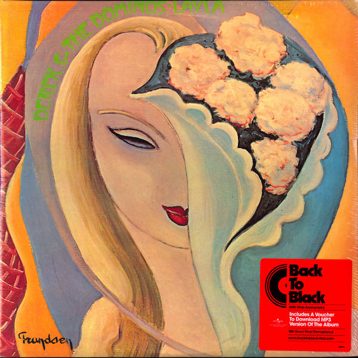

# Layla And Other Assorted Love Songs

By Derek & The Dominos

## Album Data

[Discogs URL](https://www.discogs.com/release/1641230-Derek-The-Dominos-Layla-And-Other-Assorted-Love-Songs)

- Label: Polydor
- Formats: Vinyl, LP, Album, Reissue, Remastered
- Genres: Rock, Blues Rock, Classic Rock
- Rating: 4.52
- Released: 2008
- Year: 1970
- Release ID: 1641230
- Media condition: 
- Sleeve condition: 
- Speed: 
- Weight: 
- Notes: 

## Album Tracks

| **Position** | **Title** | **Duration** |
|--------------|-----------|--------------|
| A1 | **I Looked Away** | 3:04 |
| A2 | **Bell Bottom Blues** | 5:06 |
| A3 | **Keep On Growing** | 6:22 |
| A4 | **Nobody Knows You When You're Down And Out** | 4:57 |
| B1 | **I Am Yours** | 3:32 |
| B2 | **Anyday** | 6:37 |
| B3 | **Key To The Highway** | 9:47 |
| C1 | **Tell The Truth** | 6:45 |
| C2 | **Why Does Love Got To Be So Sad?** | 4:50 |
| C3 | **Have You Ever Loved A Woman** | 6:51 |
| D1 | **Little Wing** | 5:23 |
| D2 | **It's Too Late** | 3:45 |
| D3 | **Layla** | 7:10 |
| D4 | **Thorn Tree In The Garden** | 2:51 |

## Artist Roles

| **Name** | **Role** |
|----------|----------|
| **Carl Radle** | Bass, Percussion |
| **Jim Gordon** | Drums, Percussion, Piano |
| **Chuck Kirkpatrick** | Engineer |
| **Howard Albert** | Engineer |
| **Karl Richardson** | Engineer |
| **Mack Emerman** | Engineer |
| **Ron Albert** | Engineer |
| **Duane Allman** | Guitar |
| **Eric Clapton** | Guitar, Lead Vocals |
| **Bobby Whitlock** | Organ, Piano, Vocals, Acoustic Guitar |
| **The Dominos** | Producer, Arranged By |

