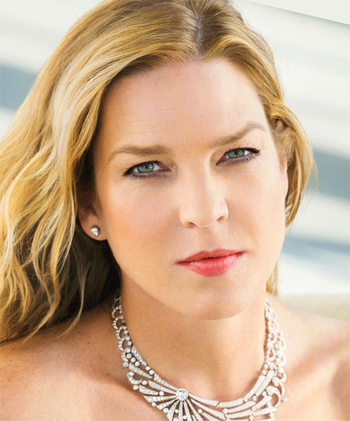

# Diana Krall

## Artist Profile

Award winning Canadian jazz pianist and singer, born November 16, 1964 in Nanaimo, British Columbia, Canada. She is married to Elvis Costello. Also a member of the Order Of Canada.

## Artist Links

- [http://www.dianakrall.com/](http://www.dianakrall.com/)
- [http://www.facebook.com/dianakrall](http://www.facebook.com/dianakrall)
- [https://www.instagram.com/DianaKrall/](https://www.instagram.com/DianaKrall/)
- [http://www.last.fm/music/Diana+Krall](http://www.last.fm/music/Diana+Krall)
- [http://www.myspace.com/dianakrall](http://www.myspace.com/dianakrall)
- [http://twitter.com/dianakrall](http://twitter.com/dianakrall)
- [http://en.wikipedia.org/wiki/Diana_Krall](http://en.wikipedia.org/wiki/Diana_Krall)
- [http://www.youtube.com/user/OfficialDianaKrall](http://www.youtube.com/user/OfficialDianaKrall)

## See also

- [The Girl In The Other Room](The_Girl_In_The_Other_Room.md)
