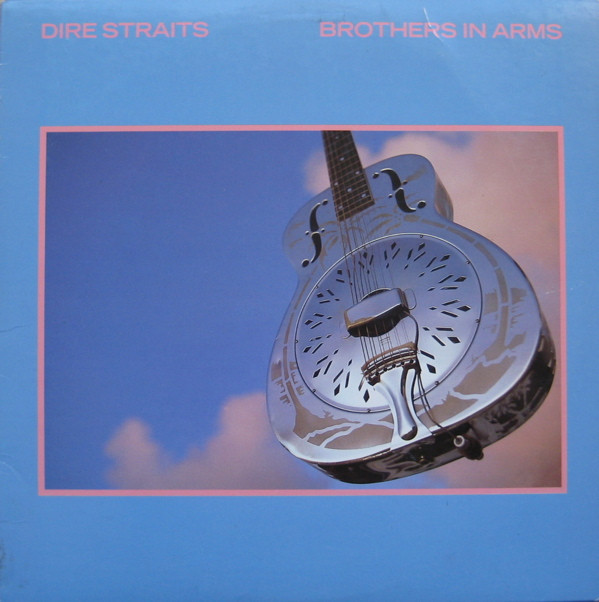

# Brothers In Arms

By Dire Straits

## Album Data

[Discogs URL](https://www.discogs.com/release/770027-Dire-Straits-Brothers-In-Arms)

- Label: Warner Bros. Records
Warner Bros. Records
- Formats: Vinyl, LP, Album, Stereo
- Genres: Rock, Classic Rock, AOR, Rock & Roll, Pop Rock
- Rating: 4.31
- Released: 1985-05-00
- Year: 1985
- Release ID: 770027
- Media condition: 
- Sleeve condition: 
- Speed: 
- Weight: 
- Notes: 

## Album Tracks

| **Position** | **Title** | **Duration** |
|--------------|-----------|--------------|
| A1 | **So Far Away** | 3:59 |
| A2 | **Money For Nothing** | 7:04 |
| A3 | **Walk Of Life** | 4:07 |
| A4 | **Your Latest Trick** | 4:46 |
| A5 | **Why Worry** | 5:22 |
| B1 | **Ride Across The River** | 6:57 |
| B2 | **The Man's Too Strong** | 4:36 |
| B3 | **One World** | 3:36 |
| B4 | **Brothers In Arms** | 6:56 |

## Artist Roles

| **Name** | **Role** |
|----------|----------|
| **Tony Levin** | Bass [Uncredited] |
| **John Illsley** | Bass, Vocals |
| **Omar Hakim** | Drums |
| **Terry Williams (3)** | Drums |
| **Steve Jackson (3)** | Engineer [Assisted By, Air Montserrat] |
| **Bruce Lampcov** | Engineer [Assisted By, Power Station] |
| **Dave Greenberg** | Engineer [Assisted By, Power Station] |
| **Neil Dorfsman** | Engineer [Engineered By] |
| **Mark Knopfler** | Guitar [Guitars], Vocals |
| **Alan Clark** | Keyboards |
| **Guy Fletcher** | Keyboards, Vocals |
| **Bob Ludwig** | Lacquer Cut By |
| **Bob Ludwig** | Mastered By [Masterdisk] |
| **John Dent** | Mastered By [Sound Clinic] |
| **Thomas Steyer** | Painting |
| **Deborah Feingold** | Photography By |
| **Mark Knopfler** | Producer [Produced By] |
| **Neil Dorfsman** | Producer [Produced By] |
| **Sutton Cooper** | Sleeve |
| **Mark Knopfler** | Songwriter [Songs Written By] |

