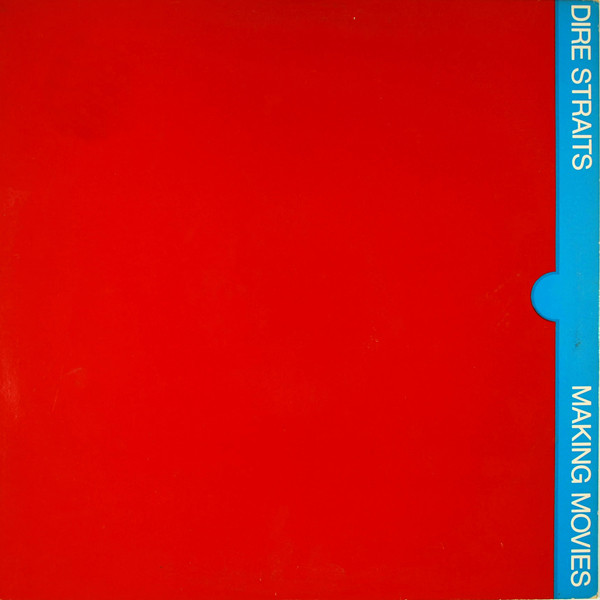

# Making Movies

By Dire Straits

## Album Data

[Discogs URL](https://www.discogs.com/release/1653947-Dire-Straits-Making-Movies)

- Label: Warner Bros. Records
- Formats: Vinyl, LP, Album, Stereo
- Genres: Rock, Pop Rock, Rock & Roll
- Rating: 4.11
- Released: 1980
- Year: 1980
- Release ID: 1653947
- Media condition: 
- Sleeve condition: 
- Speed: 
- Weight: 
- Notes: 

## Album Tracks

| **Position** | **Title** | **Duration** |
|--------------|-----------|--------------|
| A1 | **Tunnel Of Love** | 8:09 |
| A2 | **Romeo And Juliet** | 5:57 |
| A3 | **Skateaway** | 6:38 |
| B1 | **Expresso Love** | 5:11 |
| B2 | **Hand In Hand** | 4:48 |
| B3 | **Solid Rock** | 3:25 |
| B4 | **Les Boys** | 4:07 |

## Artist Roles

| **Name** | **Role** |
|----------|----------|
| **Neil Terk** | Artwork |
| **John Illsley** | Bass, Vocals |
| **Pick Withers** | Drums, Vocals |
| **Shelly Yakus** | Engineer |
| **Jeff Hendrickson** | Engineer [Assistant] |
| **Jon Mathias** | Engineer [Assistant] |
| **Roy Bittan** | Keyboards |
| **Greg Calbi** | Mastered By |
| **Brian Griffin (3)** | Photography By |
| **Jimmy Iovine** | Producer |
| **Mark Knopfler** | Producer |
| **Mark Knopfler** | Vocals, Guitar |
| **Mark Knopfler** | Written-By |

