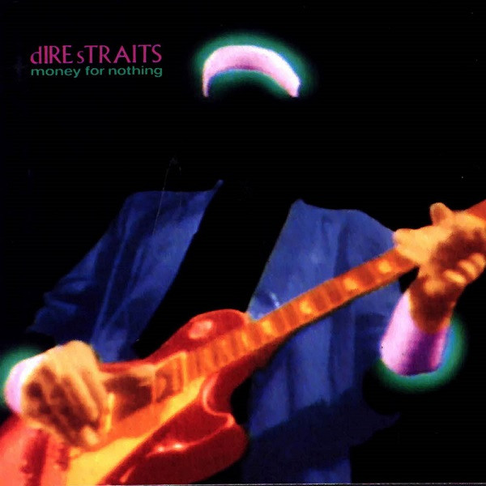

# Money For Nothing

By Dire Straits

## Album Data

[Discogs URL](https://www.discogs.com/release/860323-Dire-Straits-Money-For-Nothing)

- Label: Warner Bros. Records
Warner Bros. Records
- Formats: Vinyl, 7", 45 RPM, Single
- Genres: Rock, Pop Rock, Classic Rock
- Rating: 4.15
- Released: 1985
- Year: 1985
- Release ID: 860323
- Media condition: 
- Sleeve condition: 
- Speed: 
- Weight: 
- Notes: 

## Album Tracks

| **Position** | **Title** | **Duration** |
|--------------|-----------|--------------|
| A | **Money For Nothing (Long Edit)** | 4:38 |
| B | **Love Over Gold (Live)** | 3:41 |

## Artist Roles

| **Name** | **Role** |
|----------|----------|
| **Bob Ludwig** | Mastered By |

